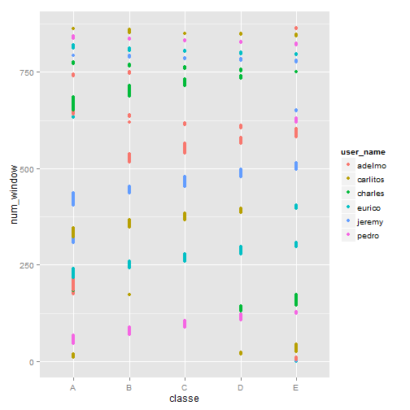

MLproject
========================================================
author: Druce Vertes
date: 5/26/2015

Classify Fitbit data for correct form in bicep curls
========================================================

- Data file with ~160 data columns collected from Fitbit
- Classified as to whether user was using correct form
- Train a classifier to identify which observations are correct form
Load libraries
========================================================


```r
############################################################
# load some libraries
############################################################

mylibraries = c("lattice","ggplot2","caret","arm","MASS",
   "Matrix","lme4","Rcpp","caTools","randomForest")

invisible(lapply(mylibraries, require, character.only=T))
```
Load data
========================================================


```r
training<-read.csv('pml-training.csv',na.strings = c("NA","#DIV/0!", ""))
testing<-read.csv('pml-training.csv',na.strings = c("NA","#DIV/0!", ""))
```
Explore data
========================================================


```r
table(training$classe)
```

```

   A    B    C    D    E 
5580 3797 3422 3216 3607 
```
Histogram
========================================================


```r
qplot(training$classe, geom="histogram")
```

 
Count NAs
========================================================


```r
countMissing <- function(mycol) {
    return (sum(is.na(training[, mycol]))/ nrow(training))
}
countNAs <- data.frame(countNA=sapply(colnames(training), countMissing))
subset(countNAs, countNAs$countNA > 0.5)
```

```
                           countNA
kurtosis_roll_belt       0.9798186
kurtosis_picth_belt      0.9809398
kurtosis_yaw_belt        1.0000000
skewness_roll_belt       0.9797676
skewness_roll_belt.1     0.9809398
skewness_yaw_belt        1.0000000
max_roll_belt            0.9793089
max_picth_belt           0.9793089
max_yaw_belt             0.9798186
min_roll_belt            0.9793089
min_pitch_belt           0.9793089
min_yaw_belt             0.9798186
amplitude_roll_belt      0.9793089
amplitude_pitch_belt     0.9793089
amplitude_yaw_belt       0.9798186
var_total_accel_belt     0.9793089
avg_roll_belt            0.9793089
stddev_roll_belt         0.9793089
var_roll_belt            0.9793089
avg_pitch_belt           0.9793089
stddev_pitch_belt        0.9793089
var_pitch_belt           0.9793089
avg_yaw_belt             0.9793089
stddev_yaw_belt          0.9793089
var_yaw_belt             0.9793089
var_accel_arm            0.9793089
avg_roll_arm             0.9793089
stddev_roll_arm          0.9793089
var_roll_arm             0.9793089
avg_pitch_arm            0.9793089
stddev_pitch_arm         0.9793089
var_pitch_arm            0.9793089
avg_yaw_arm              0.9793089
stddev_yaw_arm           0.9793089
var_yaw_arm              0.9793089
kurtosis_roll_arm        0.9832841
kurtosis_picth_arm       0.9833860
kurtosis_yaw_arm         0.9798695
skewness_roll_arm        0.9832331
skewness_pitch_arm       0.9833860
skewness_yaw_arm         0.9798695
max_roll_arm             0.9793089
max_picth_arm            0.9793089
max_yaw_arm              0.9793089
min_roll_arm             0.9793089
min_pitch_arm            0.9793089
min_yaw_arm              0.9793089
amplitude_roll_arm       0.9793089
amplitude_pitch_arm      0.9793089
amplitude_yaw_arm        0.9793089
kurtosis_roll_dumbbell   0.9795638
kurtosis_picth_dumbbell  0.9794109
kurtosis_yaw_dumbbell    1.0000000
skewness_roll_dumbbell   0.9795128
skewness_pitch_dumbbell  0.9793599
skewness_yaw_dumbbell    1.0000000
max_roll_dumbbell        0.9793089
max_picth_dumbbell       0.9793089
max_yaw_dumbbell         0.9795638
min_roll_dumbbell        0.9793089
min_pitch_dumbbell       0.9793089
min_yaw_dumbbell         0.9795638
amplitude_roll_dumbbell  0.9793089
amplitude_pitch_dumbbell 0.9793089
amplitude_yaw_dumbbell   0.9795638
var_accel_dumbbell       0.9793089
avg_roll_dumbbell        0.9793089
stddev_roll_dumbbell     0.9793089
var_roll_dumbbell        0.9793089
avg_pitch_dumbbell       0.9793089
stddev_pitch_dumbbell    0.9793089
var_pitch_dumbbell       0.9793089
avg_yaw_dumbbell         0.9793089
stddev_yaw_dumbbell      0.9793089
var_yaw_dumbbell         0.9793089
kurtosis_roll_forearm    0.9835898
kurtosis_picth_forearm   0.9836408
kurtosis_yaw_forearm     1.0000000
skewness_roll_forearm    0.9835389
skewness_pitch_forearm   0.9836408
skewness_yaw_forearm     1.0000000
max_roll_forearm         0.9793089
max_picth_forearm        0.9793089
max_yaw_forearm          0.9835898
min_roll_forearm         0.9793089
min_pitch_forearm        0.9793089
min_yaw_forearm          0.9835898
amplitude_roll_forearm   0.9793089
amplitude_pitch_forearm  0.9793089
amplitude_yaw_forearm    0.9835898
var_accel_forearm        0.9793089
avg_roll_forearm         0.9793089
stddev_roll_forearm      0.9793089
var_roll_forearm         0.9793089
avg_pitch_forearm        0.9793089
stddev_pitch_forearm     0.9793089
var_pitch_forearm        0.9793089
avg_yaw_forearm          0.9793089
stddev_yaw_forearm       0.9793089
var_yaw_forearm          0.9793089
```
Omit columns with mostly NAs
========================================================


```r
# We see a number of summary columns with 97% of data NA
# we can safely delete them since we want to predict on individual reps
colsToDeleteNA <- countNAs$countNA > 0.9
training <- training[, !colsToDeleteNA]
```
Identify low-information columns
========================================================


```r
nearzero <- nearZeroVar(training, saveMetrics=TRUE)
nearzero[nearzero$nzv==TRUE, ]
```

```
           freqRatio percentUnique zeroVar  nzv
new_window  47.33005    0.01019264   FALSE TRUE
```
Delete descriptive columns
========================================================


```r
# first 7 columns are descriptive, no predictive value and can be omitted
colsToDeleteLabels <- names(training)[1:7]
training <- training[,8:60]
```
Correlation analysis
========================================================


```r
# correlation analysis
mycorr = cor(training[-53])
hicorr = findCorrelation(mycorr, cutoff=0.8, verbose=FALSE)
colnames(training)[hicorr]
```

```
 [1] "accel_belt_z"     "roll_belt"        "accel_belt_y"    
 [4] "accel_dumbbell_z" "accel_belt_x"     "pitch_belt"      
 [7] "accel_arm_x"      "accel_dumbbell_x" "magnet_arm_y"    
[10] "gyros_arm_y"      "gyros_forearm_z"  "gyros_dumbbell_x"
```

```r
corrmatrix = matrix(mycorr[hicorr,hicorr], nrow=12, ncol=12, dimnames=list(colnames(training)[hicorr]))
colnames(corrmatrix)<- colnames(training)[hicorr]
corrmatrix[(corrmatrix > -0.8 & corrmatrix < 0.8) ] <- NA
```
Correlation analysis - output
========================================================

```r
# correlation analysis
corrmatrix
```

```
                 accel_belt_z  roll_belt accel_belt_y accel_dumbbell_z
accel_belt_z        1.0000000 -0.9920085   -0.9333854               NA
roll_belt          -0.9920085  1.0000000    0.9248983               NA
accel_belt_y       -0.9333854  0.9248983    1.0000000               NA
accel_dumbbell_z           NA         NA           NA                1
accel_belt_x               NA         NA           NA               NA
pitch_belt                 NA         NA           NA               NA
accel_arm_x                NA         NA           NA               NA
accel_dumbbell_x           NA         NA           NA               NA
magnet_arm_y               NA         NA           NA               NA
gyros_arm_y                NA         NA           NA               NA
gyros_forearm_z            NA         NA           NA               NA
gyros_dumbbell_x           NA         NA           NA               NA
                 accel_belt_x pitch_belt accel_arm_x accel_dumbbell_x
accel_belt_z               NA         NA          NA               NA
roll_belt                  NA         NA          NA               NA
accel_belt_y               NA         NA          NA               NA
accel_dumbbell_z           NA         NA          NA               NA
accel_belt_x        1.0000000 -0.9657334          NA               NA
pitch_belt         -0.9657334  1.0000000          NA               NA
accel_arm_x                NA         NA           1               NA
accel_dumbbell_x           NA         NA          NA                1
magnet_arm_y               NA         NA          NA               NA
gyros_arm_y                NA         NA          NA               NA
gyros_forearm_z            NA         NA          NA               NA
gyros_dumbbell_x           NA         NA          NA               NA
                 magnet_arm_y gyros_arm_y gyros_forearm_z gyros_dumbbell_x
accel_belt_z               NA          NA              NA               NA
roll_belt                  NA          NA              NA               NA
accel_belt_y               NA          NA              NA               NA
accel_dumbbell_z           NA          NA              NA               NA
accel_belt_x               NA          NA              NA               NA
pitch_belt                 NA          NA              NA               NA
accel_arm_x                NA          NA              NA               NA
accel_dumbbell_x           NA          NA              NA               NA
magnet_arm_y                1          NA              NA               NA
gyros_arm_y                NA           1              NA               NA
gyros_forearm_z            NA          NA       1.0000000       -0.9144764
gyros_dumbbell_x           NA          NA      -0.9144764        1.0000000
```

Correlation analysis - conclusion
========================================================

- We could delete highly correlated columns and lose some signal
- We can do PCA decomposition for dimensionality reduction and orthogonality
- Only 12 columns, let's try to classify with and without PCA and see which works better

Explore PCA decomposition
========================================================


```
        accel_belt_y            roll_belt     total_accel_belt 
       -0.3168011935        -0.3076716804        -0.3041917731 
            yaw_belt     accel_dumbbell_x    magnet_dumbbell_x 
       -0.2010722344        -0.1702179016        -0.1687782042 
         accel_arm_x          gyros_arm_z     accel_dumbbell_z 
       -0.1612499181        -0.1572717094        -0.1535931951 
       pitch_forearm          accel_arm_z         yaw_dumbbell 
       -0.1453127582        -0.1264639221        -0.1244940325 
      pitch_dumbbell         gyros_belt_y         magnet_arm_x 
       -0.1093128275        -0.1033395676        -0.0907581158 
     gyros_forearm_x     magnet_forearm_z      accel_forearm_z 
       -0.0698277425        -0.0385071227        -0.0313399177 
          pitch_belt        magnet_belt_x          gyros_arm_x 
       -0.0239466679        -0.0162368109        -0.0113088256 
     gyros_forearm_y     gyros_dumbbell_x     gyros_dumbbell_y 
       -0.0035060006        -0.0033591985        -0.0011452279 
 total_accel_forearm     gyros_dumbbell_z      gyros_forearm_z 
       -0.0007102009        -0.0002556022         0.0021188166 
        accel_belt_x     magnet_forearm_y         magnet_arm_z 
        0.0088549150         0.0246468676         0.0325522543 
     accel_forearm_y            pitch_arm              yaw_arm 
        0.0349199931         0.0366001705         0.0509146103 
       magnet_belt_z             roll_arm         roll_forearm 
        0.0596326428         0.0627870890         0.0647580691 
        magnet_arm_y          gyros_arm_y        roll_dumbbell 
        0.0658493153         0.0756839766         0.0869135175 
        gyros_belt_x     magnet_forearm_x      total_accel_arm 
        0.0943214517         0.1052483463         0.1112367264 
         yaw_forearm        magnet_belt_y    magnet_dumbbell_y 
        0.1139018574         0.1164231037         0.1457448930 
total_accel_dumbbell    magnet_dumbbell_z         gyros_belt_z 
        0.1684470163         0.1706385083         0.1795831928 
    accel_dumbbell_y      accel_forearm_x          accel_arm_y 
        0.1814921839         0.1920030723         0.2689200936 
        accel_belt_z 
        0.3165883436 
```
Plot most significant variables v. each other
========================================================
 
Plot most significant variables v. each other - 2
========================================================
 
Plot top 2 PCA components v. each other
========================================================
 

PCA - conclusion
========================================================

- The variables show some promising grouping
- PCA components group the observations into 5 clear groups 
- But they don't line up with the variable we want to predict (colors)
- Like it's separating individual styles, not good/bad form

Train classifiers - set up a loop with various methods
========================================================

```r
myMethods <- c("bayesglm", "LogitBoost", "nnet", "rf", "gbm", "svmLinear", "svmRadial")

runModel <- function(txpar, mxpar) {
    return (train(classe ~ ., data=training, method=mxpar, trControl=txpar, verbose=FALSE))
}

runModelPCA <- function(txpar, mxpar) {
    return (train(classe ~ ., data=training, method=mxpar, preProcess="pca", trControl=txpar, verbose=FALSE))
}
```
Train models
========================================================
- Loop through methods
- Train on raw data, and preprocessing with PCA 
- K-fold cross-validation with 10 folds (default)
- Run for ~4 hours, store results
- Random forest (rf) classifies correctly 99.5% of observations
- PCA does not improve results, except neural net from ~40% to 60%
- Hypothesis: In the case of NN, dimensionality reduction helps the algorithm more than the information loss hurts, so accuracy goes from ~0.4 to 0.6
Results
========================================================
model                              Accuracy   Kappa

Bayesian Generalized Linear Model     0.402   0.236
Boosted Logistic Regression           0.903   0.877
Neural Network                        0.451   0.308
Random Forest                         0.995   0.994
SVM with Linear Kernel                0.787   0.729
SVM with Radial Basis Kernel          0.938   0.922
RF classifier
========================================================

```r
#RFclassifier = train(classe ~ ., data=training, method="rf", trControl=trainControl(method="cv"), verbose=FALSE)
```
RF classifier Results
========================================================
19622 samples
   52 predictor
    5 classes: 'A', 'B', 'C', 'D', 'E' 

No pre-processing
Resampling: Cross-Validated (10 fold) 

Summary of sample sizes: 17659, 17660, 17660, 17658, 17660, 17662, ... 

Resampling results across tuning parameters:

  mtry  Accuracy   Kappa      Accuracy SD  Kappa SD   
   2    0.9951588  0.9938759  0.001384043  0.001751029
Variable importance
========================================================
rf variable importance

  only 20 most important variables shown (out of 52)

                     Overall
roll_belt             100.00
79.59
magnet_dumbbell_z      71.93
pitch_forearm          63.51
pitch_belt             63.49
magnet_dumbbell_y      63.16
roll_forearm           54.06
magnet_dumbbell_x      54.03
accel_belt_z           44.84

Plot top 3 RF variables v. each other
========================================================
 
Plot top 3 RF variables v. each other
========================================================
 
Plot top 3 RF variables v. each other
========================================================
 
