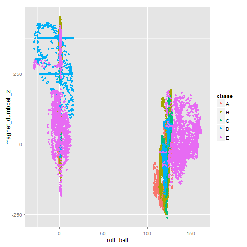

MLproject
========================================================
title: Machine Learning Project 
author: Druce Vertes - drucev at sign gmail dot com
date: Wednesday, May 27, 2015
 
- Practical Machine Learning 
- Coursera / Johns Hopkins / Data Science Specialization
- http://druce.github.io/MLProject2/MLproject.html

Classify Fitbit data for correct form in bicep curls
========================================================

- Data file with ~160 data columns collected from Fitbit wearable devices - see http://groupware.les.inf.puc-rio.br/har
- Wearers performed bicep curls under supervision of instructor
- Instructor classified observation as correct or 4 types of incorrect form (5 classifications)
- Train a classifier to learn which observations are correct form

Load libraries
========================================================


```r
library(lattice)
library(ggplot2)
library(caret)
library(MASS)
library(Matrix)
library(Rcpp)
library(lme4)
library(arm)
library(caTools)
library(randomForest)
library(parallel)
library(splines)
library(survival)
library(gbm)
library(nnet)
library(kernlab)
library(plyr)
```

Load data
========================================================


```r
setwd("C:/Users/druce/R/MLproject2")

# download data
# download.file("https://d396qusza40orc.cloudfront.net/predmachlearn/pml-training.csv", "pml-training.csv")
# download.file("https://d396qusza40orc.cloudfront.net/predmachlearn/pml-testing.csv", "pml-testing.csv")

training<-read.csv('pml-training.csv',na.strings = c("NA","#DIV/0!", ""))
testing<-read.csv('pml-testing.csv',na.strings = c("NA","#DIV/0!", ""))

# set random seed for reproducibility
# sample(1:10000, 1)
set.seed(1105)
```
Explore data
========================================================


```r
table(training$classe)
```

```

   A    B    C    D    E 
5580 3797 3422 3216 3607 
```
Histogram
========================================================

 

Clean Data
========================================================
- Find columns with mostly NAs


```r
countMissing <- function(mycol) {
    return (sum(is.na(training[, mycol]))/ nrow(training))
}
countNAs <- data.frame(countNA=sapply(colnames(training), countMissing))
subset(countNAs, countNAs$countNA > 0.5)
```

```
                           countNA
kurtosis_roll_belt       0.9798186
kurtosis_picth_belt      0.9809398
kurtosis_yaw_belt        1.0000000
skewness_roll_belt       0.9797676
skewness_roll_belt.1     0.9809398
skewness_yaw_belt        1.0000000
max_roll_belt            0.9793089
max_picth_belt           0.9793089
max_yaw_belt             0.9798186
min_roll_belt            0.9793089
min_pitch_belt           0.9793089
min_yaw_belt             0.9798186
amplitude_roll_belt      0.9793089
amplitude_pitch_belt     0.9793089
amplitude_yaw_belt       0.9798186
var_total_accel_belt     0.9793089
avg_roll_belt            0.9793089
stddev_roll_belt         0.9793089
var_roll_belt            0.9793089
avg_pitch_belt           0.9793089
stddev_pitch_belt        0.9793089
var_pitch_belt           0.9793089
avg_yaw_belt             0.9793089
stddev_yaw_belt          0.9793089
var_yaw_belt             0.9793089
var_accel_arm            0.9793089
avg_roll_arm             0.9793089
stddev_roll_arm          0.9793089
var_roll_arm             0.9793089
avg_pitch_arm            0.9793089
stddev_pitch_arm         0.9793089
var_pitch_arm            0.9793089
avg_yaw_arm              0.9793089
stddev_yaw_arm           0.9793089
var_yaw_arm              0.9793089
kurtosis_roll_arm        0.9832841
kurtosis_picth_arm       0.9833860
kurtosis_yaw_arm         0.9798695
skewness_roll_arm        0.9832331
skewness_pitch_arm       0.9833860
skewness_yaw_arm         0.9798695
max_roll_arm             0.9793089
max_picth_arm            0.9793089
max_yaw_arm              0.9793089
min_roll_arm             0.9793089
min_pitch_arm            0.9793089
min_yaw_arm              0.9793089
amplitude_roll_arm       0.9793089
amplitude_pitch_arm      0.9793089
amplitude_yaw_arm        0.9793089
kurtosis_roll_dumbbell   0.9795638
kurtosis_picth_dumbbell  0.9794109
kurtosis_yaw_dumbbell    1.0000000
skewness_roll_dumbbell   0.9795128
skewness_pitch_dumbbell  0.9793599
skewness_yaw_dumbbell    1.0000000
max_roll_dumbbell        0.9793089
max_picth_dumbbell       0.9793089
max_yaw_dumbbell         0.9795638
min_roll_dumbbell        0.9793089
min_pitch_dumbbell       0.9793089
min_yaw_dumbbell         0.9795638
amplitude_roll_dumbbell  0.9793089
amplitude_pitch_dumbbell 0.9793089
amplitude_yaw_dumbbell   0.9795638
var_accel_dumbbell       0.9793089
avg_roll_dumbbell        0.9793089
stddev_roll_dumbbell     0.9793089
var_roll_dumbbell        0.9793089
avg_pitch_dumbbell       0.9793089
stddev_pitch_dumbbell    0.9793089
var_pitch_dumbbell       0.9793089
avg_yaw_dumbbell         0.9793089
stddev_yaw_dumbbell      0.9793089
var_yaw_dumbbell         0.9793089
kurtosis_roll_forearm    0.9835898
kurtosis_picth_forearm   0.9836408
kurtosis_yaw_forearm     1.0000000
skewness_roll_forearm    0.9835389
skewness_pitch_forearm   0.9836408
skewness_yaw_forearm     1.0000000
max_roll_forearm         0.9793089
max_picth_forearm        0.9793089
max_yaw_forearm          0.9835898
min_roll_forearm         0.9793089
min_pitch_forearm        0.9793089
min_yaw_forearm          0.9835898
amplitude_roll_forearm   0.9793089
amplitude_pitch_forearm  0.9793089
amplitude_yaw_forearm    0.9835898
var_accel_forearm        0.9793089
avg_roll_forearm         0.9793089
stddev_roll_forearm      0.9793089
var_roll_forearm         0.9793089
avg_pitch_forearm        0.9793089
stddev_pitch_forearm     0.9793089
var_pitch_forearm        0.9793089
avg_yaw_forearm          0.9793089
stddev_yaw_forearm       0.9793089
var_yaw_forearm          0.9793089
```
Omit columns with mostly NAs
========================================================

- We see a number of summary columns with 97% of data NA
- We can safely delete them since we want to predict on individual observations


```r
colsToDeleteNA <- countNAs$countNA > 0.9
training <- training[, !colsToDeleteNA]
```

Identify low-information columns
========================================================


```r
nearzero <- nearZeroVar(training, saveMetrics=TRUE)
nearzero[nearzero$nzv==TRUE, ]
```

```
           freqRatio percentUnique zeroVar  nzv
new_window  47.33005    0.01019264   FALSE TRUE
```

Delete descriptive columns
========================================================


```r
# first 7 columns are descriptive, no predictive value and can be omitted
colsToDeleteLabels <- names(training)[1:7]
training <- training[,8:60]
```

Correlation analysis
========================================================


```r
# correlation analysis
mycorr <- cor(training[-53])
hicorr <- findCorrelation(mycorr, cutoff=0.8, verbose=FALSE)
colnames(training)[hicorr]
```

```
 [1] "accel_belt_z"     "roll_belt"        "accel_belt_y"    
 [4] "accel_dumbbell_z" "accel_belt_x"     "pitch_belt"      
 [7] "accel_arm_x"      "accel_dumbbell_x" "magnet_arm_y"    
[10] "gyros_arm_y"      "gyros_forearm_z"  "gyros_dumbbell_x"
```

```r
corrmatrix <- matrix(mycorr[hicorr,hicorr], nrow=12, ncol=12, dimnames=list(colnames(training)[hicorr]))
colnames(corrmatrix)<- colnames(training)[hicorr]
corrmatrix[(corrmatrix > -0.8 & corrmatrix < 0.8) ] <- NA
```

Correlation analysis - output
========================================================


```r
# correlation analysis
corrmatrix
```

```
                 accel_belt_z  roll_belt accel_belt_y accel_dumbbell_z
accel_belt_z        1.0000000 -0.9920085   -0.9333854               NA
roll_belt          -0.9920085  1.0000000    0.9248983               NA
accel_belt_y       -0.9333854  0.9248983    1.0000000               NA
accel_dumbbell_z           NA         NA           NA                1
accel_belt_x               NA         NA           NA               NA
pitch_belt                 NA         NA           NA               NA
accel_arm_x                NA         NA           NA               NA
accel_dumbbell_x           NA         NA           NA               NA
magnet_arm_y               NA         NA           NA               NA
gyros_arm_y                NA         NA           NA               NA
gyros_forearm_z            NA         NA           NA               NA
gyros_dumbbell_x           NA         NA           NA               NA
                 accel_belt_x pitch_belt accel_arm_x accel_dumbbell_x
accel_belt_z               NA         NA          NA               NA
roll_belt                  NA         NA          NA               NA
accel_belt_y               NA         NA          NA               NA
accel_dumbbell_z           NA         NA          NA               NA
accel_belt_x        1.0000000 -0.9657334          NA               NA
pitch_belt         -0.9657334  1.0000000          NA               NA
accel_arm_x                NA         NA           1               NA
accel_dumbbell_x           NA         NA          NA                1
magnet_arm_y               NA         NA          NA               NA
gyros_arm_y                NA         NA          NA               NA
gyros_forearm_z            NA         NA          NA               NA
gyros_dumbbell_x           NA         NA          NA               NA
                 magnet_arm_y gyros_arm_y gyros_forearm_z gyros_dumbbell_x
accel_belt_z               NA          NA              NA               NA
roll_belt                  NA          NA              NA               NA
accel_belt_y               NA          NA              NA               NA
accel_dumbbell_z           NA          NA              NA               NA
accel_belt_x               NA          NA              NA               NA
pitch_belt                 NA          NA              NA               NA
accel_arm_x                NA          NA              NA               NA
accel_dumbbell_x           NA          NA              NA               NA
magnet_arm_y                1          NA              NA               NA
gyros_arm_y                NA           1              NA               NA
gyros_forearm_z            NA          NA       1.0000000       -0.9144764
gyros_dumbbell_x           NA          NA      -0.9144764        1.0000000
```

Correlation analysis - conclusion
========================================================

- We could delete highly correlated columns and lose a little signal
- We could do PCA decomposition for dimensionality reduction and orthogonality
- Only 12 columns, let's try to classify with and without PCA and see which works better

Explore PCA decomposition
========================================================

```r
# PCA analysis
pcaframe<-training[-53]
preProc1 <- preProcess(pcaframe, method = c("center", "scale","pca"))
preProc1
```

```

Call:
preProcess.default(x = pcaframe, method = c("center", "scale", "pca"))

Created from 19622 samples and 52 variables
Pre-processing: centered, scaled, principal component signal extraction 

PCA needed 25 components to capture 95 percent of the variance
```

```r
# look at contributors to 1st PCA component
head(sort(preProc1$rotation[,1]))
```

```
     accel_belt_y         roll_belt  total_accel_belt          yaw_belt 
       -0.3168012        -0.3076717        -0.3041918        -0.2010722 
 accel_dumbbell_x magnet_dumbbell_x 
       -0.1702179        -0.1687782 
```

```r
head(sort(-preProc1$rotation[,1]))
```

```
     accel_belt_z       accel_arm_y   accel_forearm_x  accel_dumbbell_y 
       -0.3165883        -0.2689201        -0.1920031        -0.1814922 
     gyros_belt_z magnet_dumbbell_z 
       -0.1795832        -0.1706385 
```
Plot some significant variables
========================================================
 
Plot some significant variables - 2
========================================================
 

Plot top 2 PCA components v. each other
========================================================

```r
PCAtraining <- predict(preProc1, pcaframe)
```
 

PCA - Conclusion
========================================================

- 25 components capture 95% of variation from original 52
- The variables show some promising grouping
- PCA components group the observations into 5 clear groups 
- But they don't line up with the variable we want to predict (colors)
- It's as if it's separating individuals or another variable, not good/bad form

PCA - Conclusion 2
========================================================

- Plot vs. user names

```r
training2<-read.csv('pml-training.csv',na.strings = c("NA","#DIV/0!", ""))
PCAtraining$user_name = training2$user_name
```
 

Variable selection - discussion
========================================================

- First 2 PCA components (capturing ~30% of variance) cluster pretty well by user_name, not by form
- So, should we add user_name to our list of predictors?
- If the goal is to create an algorithm that can  predict on never-before-seen people, no.
- Since 30% of variation is explained by people, we might need a lot more people to create a truly user-independent algorithm.
- If the goal is to find a learning algorithm we can put into a device that learns about its user, it might make sense to include it.
- Test set contains same user names as training set. 
- If the goal is to get highest possible accuracy, we should include it.
- If the goal is to get highest possible accuracy, could argue for including timestamp or sequence number, in case outcome is serially correlated.

 


- We can see timestamp is quite a good predictor of classe
- Anyway, for grins, we'll include user_name, and we won't include timestamp or anything else.


```r
training$user_name <- training2$user_name
```

Train classifiers - set up a loop with various methods
========================================================

- Loop through methods
- Train on raw data, and preprocessing with PCA 
- K-fold cross-validation with 10 folds (default)
- Run for ~4 hours, store results

Set up
========================================================

```r
# list of methods we will try
myMethods <- c("rf", "gbm", "LogitBoost", "nnet", "svmLinear", "svmRadial")

#cross-validation with default 10 k-folds
trc_cv = trainControl(method="cv")

runModel <- function(mxpar) {
  # center and scale for better performance on some classification algos
  return (train(classe ~ ., data=training, method=mxpar, preProcess=c("center", "scale"), trControl=trc_cv, verbose=FALSE))
}

runModelPCA <- function(mxpar) {
    return (train(classe ~ ., data=training, method=mxpar, preProcess=c("center", "scale","pca"), trControl=trc_cv, verbose=FALSE))
}
```
Run in loop
========================================================

```r
models <- list()
modelLabels <- list()
ACC <- list()
KPP <- list()
modelsStartTime <- list()

mycount <- 0
for (mx in myMethods) {
    # set.seed(1105)     # if you want to always use same folds
    # run model, store result

    mycount <- mycount+1
    modelsStartTime[[mycount]] <- Sys.time()         
    print(sprintf ("Start %s : %s" , Sys.time(), mx))
    models[[mycount]] <- runModel(mx)
    modelLabels[[mycount]] <- models[[mycount]]$modelInfo$label
    ACC[[mycount]] <- max(models[[mycount]]$results$Accuracy)
    KPP[[mycount]] <- max(max(models[[mycount]]$results$Kappa))
    print(models[[mycount]])

    # PCA
    mycount <- mycount+1
    # set.seed(1105)     
    modelsStartTime[[mycount]] <- Sys.time()         
    print(sprintf ("Start %s : %s (PCA)" , Sys.time(), mx))
    models[[mycount]] <- runModelPCA(mx)
    modelLabels[[mycount]] <- sprintf("%s (PCA)", models[[mycount]]$modelInfo$label)
    ACC[[mycount]] <- max(models[[mycount]]$results$Accuracy)
    KPP[[mycount]] <- max(max(models[[mycount]]$results$Kappa))
    print(models[[mycount]])
   
}
```

```
[1] "Start 2015-06-02 16:37:01 : rf"
Random Forest 

19622 samples
   53 predictor
    5 classes: 'A', 'B', 'C', 'D', 'E' 

Pre-processing: centered, scaled 
Resampling: Cross-Validated (10 fold) 

Summary of sample sizes: 17659, 17660, 17660, 17658, 17660, 17662, ... 

Resampling results across tuning parameters:

  mtry  Accuracy   Kappa      Accuracy SD  Kappa SD   
   2    0.9947000  0.9932955  0.001383507  0.001750334
  29    0.9952609  0.9940053  0.001979247  0.002502999
  57    0.9904707  0.9879446  0.002606580  0.003298727

Accuracy was used to select the optimal model using  the largest value.
The final value used for the model was mtry = 29. 
[1] "Start 2015-06-02 17:46:33 : rf (PCA)"
Random Forest 

19622 samples
   53 predictor
    5 classes: 'A', 'B', 'C', 'D', 'E' 

Pre-processing: centered, scaled, principal component signal extraction 
Resampling: Cross-Validated (10 fold) 

Summary of sample sizes: 17660, 17661, 17660, 17659, 17660, 17659, ... 

Resampling results across tuning parameters:

  mtry  Accuracy   Kappa      Accuracy SD  Kappa SD   
   2    0.9826719  0.9780770  0.003298127  0.004173802
  29    0.9758439  0.9694394  0.003850303  0.004871236
  57    0.9755889  0.9691173  0.003207011  0.004054452

Accuracy was used to select the optimal model using  the largest value.
The final value used for the model was mtry = 2. 
[1] "Start 2015-06-02 18:24:31 : gbm"
Stochastic Gradient Boosting 

19622 samples
   53 predictor
    5 classes: 'A', 'B', 'C', 'D', 'E' 

Pre-processing: centered, scaled 
Resampling: Cross-Validated (10 fold) 

Summary of sample sizes: 17659, 17659, 17660, 17659, 17660, 17660, ... 

Resampling results across tuning parameters:

  interaction.depth  n.trees  Accuracy   Kappa      Accuracy SD
  1                   50      0.7545110  0.6887900  0.007864122
  1                  100      0.8224449  0.7752442  0.007643795
  1                  150      0.8557238  0.8174202  0.008337909
  2                   50      0.8549086  0.8161477  0.008684865
  2                  100      0.9070941  0.8824359  0.007992765
  2                  150      0.9322196  0.9142268  0.006740698
  3                   50      0.8976146  0.8703484  0.009649809
  3                  100      0.9446543  0.9299727  0.006244375
  3                  150      0.9643262  0.9548710  0.004842644
  Kappa SD   
  0.009854269
  0.009769249
  0.010622412
  0.011099777
  0.010138436
  0.008549470
  0.012256915
  0.007910244
  0.006128927

Tuning parameter 'shrinkage' was held constant at a value of 0.1

Tuning parameter 'n.minobsinnode' was held constant at a value of 10
Accuracy was used to select the optimal model using  the largest value.
The final values used for the model were n.trees = 150,
 interaction.depth = 3, shrinkage = 0.1 and n.minobsinnode = 10. 
[1] "Start 2015-06-02 18:46:25 : gbm (PCA)"
Stochastic Gradient Boosting 

19622 samples
   53 predictor
    5 classes: 'A', 'B', 'C', 'D', 'E' 

Pre-processing: centered, scaled, principal component signal extraction 
Resampling: Cross-Validated (10 fold) 

Summary of sample sizes: 17660, 17660, 17660, 17660, 17658, 17661, ... 

Resampling results across tuning parameters:

  interaction.depth  n.trees  Accuracy   Kappa      Accuracy SD
  1                   50      0.5613106  0.4350609  0.010994494
  1                  100      0.6216505  0.5166107  0.012579036
  1                  150      0.6499865  0.5540189  0.013320353
  2                   50      0.6658364  0.5743981  0.013871948
  2                  100      0.7291305  0.6560893  0.009554803
  2                  150      0.7657737  0.7029548  0.008569846
  3                   50      0.7260215  0.6520474  0.010330500
  3                  100      0.7879931  0.7311800  0.009519202
  3                  150      0.8237698  0.7767599  0.007623697
  Kappa SD   
  0.014310865
  0.015969643
  0.016863547
  0.017685110
  0.012387532
  0.010864098
  0.013012274
  0.012161751
  0.009705434

Tuning parameter 'shrinkage' was held constant at a value of 0.1

Tuning parameter 'n.minobsinnode' was held constant at a value of 10
Accuracy was used to select the optimal model using  the largest value.
The final values used for the model were n.trees = 150,
 interaction.depth = 3, shrinkage = 0.1 and n.minobsinnode = 10. 
[1] "Start 2015-06-02 19:01:21 : LogitBoost"
Boosted Logistic Regression 

19622 samples
   53 predictor
    5 classes: 'A', 'B', 'C', 'D', 'E' 

Pre-processing: centered, scaled 
Resampling: Cross-Validated (10 fold) 

Summary of sample sizes: 17660, 17660, 17659, 17659, 17661, 17660, ... 

Resampling results across tuning parameters:

  nIter  Accuracy   Kappa      Accuracy SD  Kappa SD  
  11     0.8125092  0.7614627  0.015752992  0.01946939
  21     0.8659367  0.8283280  0.008665648  0.01146380
  31     0.8964027  0.8683605  0.007981655  0.01000912

Accuracy was used to select the optimal model using  the largest value.
The final value used for the model was nIter = 31. 
[1] "Start 2015-06-02 19:05:37 : LogitBoost (PCA)"
Boosted Logistic Regression 

19622 samples
   53 predictor
    5 classes: 'A', 'B', 'C', 'D', 'E' 

Pre-processing: centered, scaled, principal component signal extraction 
Resampling: Cross-Validated (10 fold) 

Summary of sample sizes: 17660, 17660, 17660, 17661, 17659, 17659, ... 

Resampling results across tuning parameters:

  nIter  Accuracy   Kappa      Accuracy SD  Kappa SD  
  11     0.6157933  0.4921920  0.02172733   0.03371824
  21     0.6318316  0.5208719  0.01374525   0.02346615
  31     0.6279409  0.5144771  0.01416822   0.01991879

Accuracy was used to select the optimal model using  the largest value.
The final value used for the model was nIter = 21. 
[1] "Start 2015-06-02 19:07:06 : nnet"
# weights:  68
initial  value 28564.876620 
iter  10 value 26715.813915
iter  20 value 26426.350334
iter  30 value 25927.070586
iter  40 value 24564.708055
iter  50 value 23638.364149
iter  60 value 22733.125781
iter  70 value 22343.846541
iter  80 value 21781.058743
iter  90 value 21534.220082
iter 100 value 21446.960863
final  value 21446.960863 
stopped after 100 iterations
# weights:  194
initial  value 31837.402422 
iter  10 value 24372.928533
iter  20 value 20708.193132
iter  30 value 19468.128891
iter  40 value 18473.168510
iter  50 value 17666.647140
iter  60 value 17011.292594
iter  70 value 16412.317877
iter  80 value 15802.897805
iter  90 value 15303.484168
iter 100 value 14964.142362
final  value 14964.142362 
stopped after 100 iterations
# weights:  320
initial  value 31235.176162 
iter  10 value 22431.105425
iter  20 value 18802.782842
iter  30 value 17394.342799
iter  40 value 16325.397576
iter  50 value 15210.735017
iter  60 value 14321.895718
iter  70 value 13594.103310
iter  80 value 12932.170995
iter  90 value 12489.970296
iter 100 value 11979.480750
final  value 11979.480750 
stopped after 100 iterations
# weights:  68
initial  value 28398.941654 
iter  10 value 26335.112162
iter  20 value 24994.070044
iter  30 value 24062.229534
iter  40 value 23160.621060
iter  50 value 22332.795600
iter  60 value 21654.359193
iter  70 value 21167.428007
iter  80 value 20592.572129
iter  90 value 20029.203560
iter 100 value 19614.393864
final  value 19614.393864 
stopped after 100 iterations
# weights:  194
initial  value 30410.006470 
iter  10 value 23884.415860
iter  20 value 21443.123166
iter  30 value 20716.251267
iter  40 value 20120.602046
iter  50 value 19436.832651
iter  60 value 18888.716677
iter  70 value 18412.423499
iter  80 value 18038.549748
iter  90 value 17550.265384
iter 100 value 17224.558906
final  value 17224.558906 
stopped after 100 iterations
# weights:  320
initial  value 32313.143469 
iter  10 value 21429.694797
iter  20 value 17915.471788
iter  30 value 15702.190312
iter  40 value 14578.856392
iter  50 value 14059.636303
iter  60 value 13729.245824
iter  70 value 13376.162095
iter  80 value 12971.742300
iter  90 value 12500.293668
iter 100 value 12176.554789
final  value 12176.554789 
stopped after 100 iterations
# weights:  68
initial  value 29832.696068 
iter  10 value 26434.917940
iter  20 value 25428.703365
iter  30 value 24863.414784
iter  40 value 23601.467186
iter  50 value 22231.955124
iter  60 value 21889.023077
iter  70 value 21631.183798
iter  80 value 21498.499964
iter  90 value 21422.066608
iter 100 value 21352.103448
final  value 21352.103448 
stopped after 100 iterations
# weights:  194
initial  value 29363.937974 
iter  10 value 24331.660644
iter  20 value 21531.045289
iter  30 value 20721.465011
iter  40 value 19502.432429
iter  50 value 18586.287630
iter  60 value 17870.723900
iter  70 value 16991.947529
iter  80 value 16497.337652
iter  90 value 15851.763147
iter 100 value 15352.180288
final  value 15352.180288 
stopped after 100 iterations
# weights:  320
initial  value 36830.666841 
iter  10 value 23183.493992
iter  20 value 19352.729725
iter  30 value 16821.248757
iter  40 value 15671.071061
iter  50 value 15101.619524
iter  60 value 14275.055886
iter  70 value 13316.731661
iter  80 value 12806.652229
iter  90 value 12366.633716
iter 100 value 11961.022724
final  value 11961.022724 
stopped after 100 iterations
# weights:  68
initial  value 29628.148270 
iter  10 value 25745.664633
iter  20 value 24665.226203
iter  30 value 24119.551105
iter  40 value 23287.338254
iter  50 value 22409.757151
iter  60 value 21722.968965
iter  70 value 21412.925077
iter  80 value 21214.032083
iter  90 value 20832.848443
iter 100 value 20260.389376
final  value 20260.389376 
stopped after 100 iterations
# weights:  194
initial  value 32639.209263 
iter  10 value 25414.536588
iter  20 value 22162.388003
iter  30 value 20566.428502
iter  40 value 19449.740536
iter  50 value 18711.173049
iter  60 value 17756.703987
iter  70 value 17086.266990
iter  80 value 16702.610543
iter  90 value 16308.969987
iter 100 value 15860.800302
final  value 15860.800302 
stopped after 100 iterations
# weights:  320
initial  value 34870.005171 
iter  10 value 24467.168604
iter  20 value 18573.804479
iter  30 value 16766.801355
iter  40 value 15784.723855
iter  50 value 14377.255465
iter  60 value 13504.286983
iter  70 value 12829.877253
iter  80 value 12297.434328
iter  90 value 11733.401758
iter 100 value 11406.383101
final  value 11406.383101 
stopped after 100 iterations
# weights:  68
initial  value 31001.312412 
iter  10 value 26964.595191
iter  20 value 26261.766628
iter  30 value 25690.036484
iter  40 value 25114.644148
iter  50 value 24475.526325
iter  60 value 23752.962719
iter  70 value 23412.640094
iter  80 value 22917.904535
iter  90 value 22561.983216
iter 100 value 22067.115862
final  value 22067.115862 
stopped after 100 iterations
# weights:  194
initial  value 31611.541118 
iter  10 value 25163.489638
iter  20 value 22453.880838
iter  30 value 21206.556462
iter  40 value 20311.061220
iter  50 value 19691.324359
iter  60 value 19170.066437
iter  70 value 18651.966071
iter  80 value 18032.096119
iter  90 value 17527.155212
iter 100 value 16841.109025
final  value 16841.109025 
stopped after 100 iterations
# weights:  320
initial  value 31136.471955 
iter  10 value 22136.399670
iter  20 value 18341.214174
iter  30 value 16960.289425
iter  40 value 16075.931814
iter  50 value 15521.008904
iter  60 value 14846.270333
iter  70 value 14216.571718
iter  80 value 13614.171916
iter  90 value 13165.381389
iter 100 value 12796.283711
final  value 12796.283711 
stopped after 100 iterations
# weights:  68
initial  value 31129.235327 
iter  10 value 27117.915338
iter  20 value 26021.865573
iter  30 value 25232.292287
iter  40 value 24434.146442
iter  50 value 24010.175593
iter  60 value 23794.226484
iter  70 value 23611.199607
iter  80 value 23166.590165
iter  90 value 22153.248206
iter 100 value 21515.951354
final  value 21515.951354 
stopped after 100 iterations
# weights:  194
initial  value 30112.359059 
iter  10 value 25558.476047
iter  20 value 22190.562778
iter  30 value 20569.567453
iter  40 value 19434.336638
iter  50 value 18579.433537
iter  60 value 17940.136213
iter  70 value 17571.255288
iter  80 value 17191.558389
iter  90 value 16828.953432
iter 100 value 16390.098871
final  value 16390.098871 
stopped after 100 iterations
# weights:  320
initial  value 29985.025876 
iter  10 value 24474.796434
iter  20 value 20759.287299
iter  30 value 19036.486728
iter  40 value 17788.022806
iter  50 value 16758.516277
iter  60 value 15884.963713
iter  70 value 15212.584818
iter  80 value 14665.554256
iter  90 value 14002.279051
iter 100 value 13132.529103
final  value 13132.529103 
stopped after 100 iterations
# weights:  68
initial  value 31075.188771 
iter  10 value 26030.944445
iter  20 value 24688.781331
iter  30 value 23782.287627
iter  40 value 23049.196631
iter  50 value 22424.583523
iter  60 value 21715.942815
iter  70 value 21419.033159
iter  80 value 21280.235114
iter  90 value 21039.798496
iter 100 value 20642.775012
final  value 20642.775012 
stopped after 100 iterations
# weights:  194
initial  value 31769.734252 
iter  10 value 25821.339149
iter  20 value 23908.541616
iter  30 value 21939.582509
iter  40 value 19992.587158
iter  50 value 19204.237390
iter  60 value 18415.035768
iter  70 value 17092.495243
iter  80 value 16141.857590
iter  90 value 15476.778889
iter 100 value 14895.499410
final  value 14895.499410 
stopped after 100 iterations
# weights:  320
initial  value 28925.838290 
iter  10 value 22582.352083
iter  20 value 19108.945098
iter  30 value 16996.743627
iter  40 value 15436.355330
iter  50 value 14689.513931
iter  60 value 14228.398795
iter  70 value 13466.689210
iter  80 value 12819.788109
iter  90 value 12228.178700
iter 100 value 11741.513197
final  value 11741.513197 
stopped after 100 iterations
# weights:  68
initial  value 29569.083025 
iter  10 value 27593.907997
iter  20 value 26468.014937
iter  30 value 24538.703794
iter  40 value 22810.725630
iter  50 value 22248.800842
iter  60 value 21939.421123
iter  70 value 21668.893863
iter  80 value 21230.311515
iter  90 value 20654.712825
iter 100 value 20103.497583
final  value 20103.497583 
stopped after 100 iterations
# weights:  194
initial  value 30454.200057 
iter  10 value 24563.285989
iter  20 value 21966.410175
iter  30 value 20577.855906
iter  40 value 19466.356862
iter  50 value 18918.529608
iter  60 value 18400.778782
iter  70 value 17507.282151
iter  80 value 16801.168335
iter  90 value 16194.467518
iter 100 value 15716.381840
final  value 15716.381840 
stopped after 100 iterations
# weights:  320
initial  value 32507.990837 
iter  10 value 23493.740665
iter  20 value 18299.288475
iter  30 value 16186.252688
iter  40 value 15407.552556
iter  50 value 14764.753201
iter  60 value 14055.439039
iter  70 value 13446.446603
iter  80 value 13013.053919
iter  90 value 12576.146226
iter 100 value 12202.569038
final  value 12202.569038 
stopped after 100 iterations
# weights:  68
initial  value 29992.088512 
iter  10 value 26794.160403
iter  20 value 23176.323295
iter  30 value 22172.861579
iter  40 value 21807.609735
iter  50 value 21466.568955
iter  60 value 21072.995867
iter  70 value 20708.590009
iter  80 value 20140.907244
iter  90 value 19566.197850
iter 100 value 19406.324878
final  value 19406.324878 
stopped after 100 iterations
# weights:  194
initial  value 28962.609377 
iter  10 value 25067.898620
iter  20 value 22850.196322
iter  30 value 21718.779240
iter  40 value 21143.298026
iter  50 value 20761.815190
iter  60 value 20340.261789
iter  70 value 19714.498145
iter  80 value 18756.338894
iter  90 value 18019.496948
iter 100 value 17155.825789
final  value 17155.825789 
stopped after 100 iterations
# weights:  320
initial  value 29533.578664 
iter  10 value 22411.412846
iter  20 value 19068.537047
iter  30 value 17081.842441
iter  40 value 16233.481606
iter  50 value 15218.005997
iter  60 value 14223.996549
iter  70 value 13472.303565
iter  80 value 12894.234962
iter  90 value 12457.012661
iter 100 value 12131.214032
final  value 12131.214032 
stopped after 100 iterations
# weights:  68
initial  value 31078.545139 
iter  10 value 26377.853842
iter  20 value 25369.989076
iter  30 value 23993.974004
iter  40 value 22780.113350
iter  50 value 22192.055935
iter  60 value 21557.769783
iter  70 value 21278.711370
iter  80 value 21142.345926
iter  90 value 20865.117333
iter 100 value 20457.438309
final  value 20457.438309 
stopped after 100 iterations
# weights:  194
initial  value 29533.464494 
iter  10 value 23521.647868
iter  20 value 20006.931473
iter  30 value 18833.959681
iter  40 value 18224.927598
iter  50 value 17755.339964
iter  60 value 17300.192796
iter  70 value 16931.411027
iter  80 value 16603.559587
iter  90 value 16103.786258
iter 100 value 15857.002316
final  value 15857.002316 
stopped after 100 iterations
# weights:  320
initial  value 31185.883057 
iter  10 value 22250.573220
iter  20 value 16502.138962
iter  30 value 14186.062776
iter  40 value 13335.823767
iter  50 value 12544.907400
iter  60 value 11818.060750
iter  70 value 11307.785375
iter  80 value 10832.567509
iter  90 value 10471.547222
iter 100 value 10089.797813
final  value 10089.797813 
stopped after 100 iterations
# weights:  68
initial  value 28942.687810 
iter  10 value 26018.817882
iter  20 value 25634.882445
iter  30 value 25145.444062
iter  40 value 24011.015987
iter  50 value 22718.005003
iter  60 value 21547.203134
iter  70 value 20848.906715
iter  80 value 19787.152383
iter  90 value 19482.375251
iter 100 value 19368.545801
final  value 19368.545801 
stopped after 100 iterations
# weights:  194
initial  value 29818.722418 
iter  10 value 24520.666256
iter  20 value 22819.778180
iter  30 value 21163.850182
iter  40 value 19935.172062
iter  50 value 18788.327209
iter  60 value 17967.309527
iter  70 value 17402.361342
iter  80 value 16986.962475
iter  90 value 16701.561337
iter 100 value 16292.135047
final  value 16292.135047 
stopped after 100 iterations
# weights:  320
initial  value 29166.166552 
iter  10 value 21970.810073
iter  20 value 18468.234904
iter  30 value 15950.556160
iter  40 value 15024.977016
iter  50 value 14559.047069
iter  60 value 14015.061514
iter  70 value 13466.277923
iter  80 value 12982.864412
iter  90 value 12427.452857
iter 100 value 12033.728978
final  value 12033.728978 
stopped after 100 iterations
# weights:  68
initial  value 29108.117477 
iter  10 value 26027.010056
iter  20 value 24486.459449
iter  30 value 23851.059796
iter  40 value 23295.220875
iter  50 value 22809.810400
iter  60 value 22090.538729
iter  70 value 21711.594454
iter  80 value 21494.017645
iter  90 value 21373.173923
iter 100 value 21129.700281
final  value 21129.700281 
stopped after 100 iterations
# weights:  194
initial  value 32314.831819 
iter  10 value 25576.162080
iter  20 value 23340.688155
iter  30 value 22074.184098
iter  40 value 20623.072601
iter  50 value 19006.062701
iter  60 value 17748.656439
iter  70 value 16944.689964
iter  80 value 16544.857543
iter  90 value 16150.322144
iter 100 value 15658.584246
final  value 15658.584246 
stopped after 100 iterations
# weights:  320
initial  value 32723.513601 
iter  10 value 24096.090980
iter  20 value 19712.717365
iter  30 value 17406.032615
iter  40 value 16224.077870
iter  50 value 15538.602660
iter  60 value 15035.880294
iter  70 value 14053.519027
iter  80 value 13140.240137
iter  90 value 12560.676954
iter 100 value 12065.702136
final  value 12065.702136 
stopped after 100 iterations
# weights:  68
initial  value 28906.217913 
iter  10 value 26900.495857
iter  20 value 25091.431313
iter  30 value 23936.306082
iter  40 value 22678.685446
iter  50 value 21944.423199
iter  60 value 21568.929279
iter  70 value 21320.868306
iter  80 value 21265.701491
iter  90 value 20942.372766
iter 100 value 20486.168332
final  value 20486.168332 
stopped after 100 iterations
# weights:  194
initial  value 30997.658607 
iter  10 value 23783.284958
iter  20 value 20559.156604
iter  30 value 18493.619992
iter  40 value 17657.907519
iter  50 value 17023.311647
iter  60 value 16188.638057
iter  70 value 15799.282730
iter  80 value 15434.143240
iter  90 value 15168.317418
iter 100 value 14797.175844
final  value 14797.175844 
stopped after 100 iterations
# weights:  320
initial  value 30808.166258 
iter  10 value 23720.590150
iter  20 value 19052.834350
iter  30 value 17477.803775
iter  40 value 16546.270647
iter  50 value 15759.086110
iter  60 value 14613.579920
iter  70 value 13807.564039
iter  80 value 13248.658312
iter  90 value 12865.734219
iter 100 value 12527.279809
final  value 12527.279809 
stopped after 100 iterations
# weights:  68
initial  value 30533.960435 
iter  10 value 27105.762290
iter  20 value 26000.949974
iter  30 value 25172.655486
iter  40 value 24393.634595
iter  50 value 23998.306517
iter  60 value 23134.143613
iter  70 value 21957.149177
iter  80 value 21484.804849
iter  90 value 21161.617520
iter 100 value 20352.060289
final  value 20352.060289 
stopped after 100 iterations
# weights:  194
initial  value 31494.078814 
iter  10 value 24471.452379
iter  20 value 21727.887889
iter  30 value 20323.585524
iter  40 value 19353.187834
iter  50 value 18637.385348
iter  60 value 18126.349385
iter  70 value 17386.379597
iter  80 value 16640.717636
iter  90 value 16130.659912
iter 100 value 15611.653905
final  value 15611.653905 
stopped after 100 iterations
# weights:  320
initial  value 31980.960207 
iter  10 value 24145.738080
iter  20 value 20014.519725
iter  30 value 17732.474204
iter  40 value 16687.148321
iter  50 value 15972.643246
iter  60 value 15300.184211
iter  70 value 14689.206888
iter  80 value 14191.268896
iter  90 value 13795.765951
iter 100 value 13441.495740
final  value 13441.495740 
stopped after 100 iterations
# weights:  68
initial  value 33575.488607 
iter  10 value 27897.367344
iter  20 value 27437.119197
iter  30 value 26223.846896
iter  40 value 25183.805667
iter  50 value 23786.282113
iter  60 value 22926.144118
iter  70 value 22600.966463
iter  80 value 21935.262752
iter  90 value 21502.690748
iter 100 value 21345.460641
final  value 21345.460641 
stopped after 100 iterations
# weights:  194
initial  value 30967.184873 
iter  10 value 24547.503376
iter  20 value 20069.554185
iter  30 value 18499.558127
iter  40 value 17783.950279
iter  50 value 16893.743658
iter  60 value 16103.216534
iter  70 value 15731.794918
iter  80 value 15445.621564
iter  90 value 14997.499232
iter 100 value 14750.672031
final  value 14750.672031 
stopped after 100 iterations
# weights:  320
initial  value 30960.335858 
iter  10 value 24107.492615
iter  20 value 20634.410662
iter  30 value 18845.562853
iter  40 value 17852.096989
iter  50 value 16645.922499
iter  60 value 15800.604025
iter  70 value 15161.419733
iter  80 value 14632.838396
iter  90 value 14110.238172
iter 100 value 13799.241838
final  value 13799.241838 
stopped after 100 iterations
# weights:  68
initial  value 30536.350416 
iter  10 value 27776.354106
iter  20 value 26979.246877
iter  30 value 25228.933279
iter  40 value 24260.288027
iter  50 value 23506.887437
iter  60 value 23221.294733
iter  70 value 23063.725117
iter  80 value 22695.927721
iter  90 value 22277.066345
iter 100 value 22098.479471
final  value 22098.479471 
stopped after 100 iterations
# weights:  194
initial  value 29825.531626 
iter  10 value 25665.179013
iter  20 value 22923.916519
iter  30 value 21489.577286
iter  40 value 20153.823821
iter  50 value 19276.806824
iter  60 value 18701.789229
iter  70 value 18103.887741
iter  80 value 17630.392243
iter  90 value 16755.749293
iter 100 value 16364.271633
final  value 16364.271633 
stopped after 100 iterations
# weights:  320
initial  value 30441.225379 
iter  10 value 22869.241382
iter  20 value 18340.265983
iter  30 value 16072.529381
iter  40 value 14564.617023
iter  50 value 13714.316138
iter  60 value 13177.626945
iter  70 value 12696.232145
iter  80 value 12150.423977
iter  90 value 11556.675883
iter 100 value 11043.981722
final  value 11043.981722 
stopped after 100 iterations
# weights:  68
initial  value 28755.931479 
iter  10 value 25451.676335
iter  20 value 24704.209050
iter  30 value 23272.445510
iter  40 value 22324.451711
iter  50 value 21673.359076
iter  60 value 21364.210310
iter  70 value 20950.002954
iter  80 value 20318.404420
iter  90 value 19752.988079
iter 100 value 19542.221804
final  value 19542.221804 
stopped after 100 iterations
# weights:  194
initial  value 29974.816448 
iter  10 value 23881.495988
iter  20 value 21319.255290
iter  30 value 19807.234699
iter  40 value 18973.578408
iter  50 value 18248.396445
iter  60 value 17507.650629
iter  70 value 16901.713607
iter  80 value 16521.611436
iter  90 value 16182.241842
iter 100 value 15835.734072
final  value 15835.734072 
stopped after 100 iterations
# weights:  320
initial  value 31104.117981 
iter  10 value 21609.971543
iter  20 value 17293.455275
iter  30 value 15098.063259
iter  40 value 14144.763682
iter  50 value 13554.574274
iter  60 value 13188.087806
iter  70 value 12696.022432
iter  80 value 12277.252381
iter  90 value 11820.709102
iter 100 value 11402.057232
final  value 11402.057232 
stopped after 100 iterations
# weights:  68
initial  value 30131.195162 
iter  10 value 27361.505483
iter  20 value 26448.634315
iter  30 value 26192.726599
iter  40 value 24111.834465
iter  50 value 22612.340300
iter  60 value 21605.455194
iter  70 value 21190.099061
iter  80 value 21028.674345
iter  90 value 20784.227740
iter 100 value 20108.621677
final  value 20108.621677 
stopped after 100 iterations
# weights:  194
initial  value 32504.292859 
iter  10 value 25736.615578
iter  20 value 22583.338546
iter  30 value 21618.704113
iter  40 value 20271.363796
iter  50 value 19332.216033
iter  60 value 18639.100372
iter  70 value 17643.921810
iter  80 value 16784.190258
iter  90 value 16130.241796
iter 100 value 15726.559064
final  value 15726.559064 
stopped after 100 iterations
# weights:  320
initial  value 30434.508913 
iter  10 value 22080.344234
iter  20 value 18049.848389
iter  30 value 16327.652563
iter  40 value 14867.706113
iter  50 value 13923.661428
iter  60 value 13058.508684
iter  70 value 12427.831455
iter  80 value 11930.772179
iter  90 value 11620.203574
iter 100 value 10997.543428
final  value 10997.543428 
stopped after 100 iterations
# weights:  68
initial  value 29034.136285 
iter  10 value 26209.074610
iter  20 value 25278.722994
iter  30 value 24880.934991
iter  40 value 24141.929897
iter  50 value 23190.915443
iter  60 value 22049.682396
iter  70 value 21119.828846
iter  80 value 20538.762377
iter  90 value 19742.250996
iter 100 value 19466.827351
final  value 19466.827351 
stopped after 100 iterations
# weights:  194
initial  value 29319.403102 
iter  10 value 24840.608745
iter  20 value 22461.690836
iter  30 value 19812.770603
iter  40 value 18764.529286
iter  50 value 18006.444043
iter  60 value 17328.422799
iter  70 value 16869.191167
iter  80 value 16464.196600
iter  90 value 16189.057469
iter 100 value 15957.570066
final  value 15957.570066 
stopped after 100 iterations
# weights:  320
initial  value 31865.949191 
iter  10 value 23019.325868
iter  20 value 18056.092257
iter  30 value 16727.800991
iter  40 value 15629.872345
iter  50 value 15079.651799
iter  60 value 14592.622959
iter  70 value 13829.179004
iter  80 value 13201.335099
iter  90 value 12805.670682
iter 100 value 12441.916421
final  value 12441.916421 
stopped after 100 iterations
# weights:  68
initial  value 30514.323911 
iter  10 value 25725.777916
iter  20 value 24610.690224
iter  30 value 23587.439144
iter  40 value 22835.249926
iter  50 value 22193.581689
iter  60 value 21688.275177
iter  70 value 21349.562870
iter  80 value 20922.123417
iter  90 value 20282.527635
iter 100 value 19793.179915
final  value 19793.179915 
stopped after 100 iterations
# weights:  194
initial  value 28900.531451 
iter  10 value 22614.143016
iter  20 value 20345.508577
iter  30 value 18801.963011
iter  40 value 18004.367926
iter  50 value 17696.193192
iter  60 value 17193.963318
iter  70 value 16701.345405
iter  80 value 16367.792399
iter  90 value 16096.606070
iter 100 value 15797.509181
final  value 15797.509181 
stopped after 100 iterations
# weights:  320
initial  value 29924.555376 
iter  10 value 22884.447350
iter  20 value 18796.641314
iter  30 value 17610.150228
iter  40 value 16644.838151
iter  50 value 16221.952859
iter  60 value 15303.403425
iter  70 value 14534.299645
iter  80 value 13933.270535
iter  90 value 13415.168361
iter 100 value 12783.217859
final  value 12783.217859 
stopped after 100 iterations
# weights:  68
initial  value 30840.764720 
iter  10 value 26190.757313
iter  20 value 25119.455227
iter  30 value 24487.665429
iter  40 value 23862.726959
iter  50 value 23079.095698
iter  60 value 22236.151825
iter  70 value 21397.350860
iter  80 value 20767.223034
iter  90 value 20060.602846
iter 100 value 19557.835866
final  value 19557.835866 
stopped after 100 iterations
# weights:  194
initial  value 30716.791338 
iter  10 value 23869.470829
iter  20 value 20665.779360
iter  30 value 19379.792397
iter  40 value 18540.832530
iter  50 value 18099.714962
iter  60 value 17110.089374
iter  70 value 16527.710436
iter  80 value 16089.889543
iter  90 value 15719.930102
iter 100 value 15332.328496
final  value 15332.328496 
stopped after 100 iterations
# weights:  320
initial  value 31299.817071 
iter  10 value 22456.736283
iter  20 value 18961.191127
iter  30 value 16721.641304
iter  40 value 15782.014907
iter  50 value 14975.047741
iter  60 value 14199.603606
iter  70 value 13768.252233
iter  80 value 13572.063223
iter  90 value 13377.221247
iter 100 value 13185.802898
final  value 13185.802898 
stopped after 100 iterations
# weights:  68
initial  value 29648.448660 
iter  10 value 26627.460265
iter  20 value 25240.126695
iter  30 value 24000.312692
iter  40 value 22779.631976
iter  50 value 22079.889079
iter  60 value 21524.501531
iter  70 value 21309.754340
iter  80 value 21262.857934
iter  90 value 21192.599055
iter 100 value 20733.146599
final  value 20733.146599 
stopped after 100 iterations
# weights:  194
initial  value 31417.489361 
iter  10 value 25519.648617
iter  20 value 21721.982065
iter  30 value 20525.710494
iter  40 value 19592.824260
iter  50 value 19089.449168
iter  60 value 18378.443729
iter  70 value 17904.260752
iter  80 value 17291.984109
iter  90 value 16846.325214
iter 100 value 16539.138827
final  value 16539.138827 
stopped after 100 iterations
# weights:  320
initial  value 35001.830800 
iter  10 value 23591.433363
iter  20 value 19069.500006
iter  30 value 16506.018817
iter  40 value 15087.398158
iter  50 value 14262.427041
iter  60 value 13494.525267
iter  70 value 12831.756839
iter  80 value 12176.673883
iter  90 value 11649.910697
iter 100 value 11260.738919
final  value 11260.738919 
stopped after 100 iterations
# weights:  68
initial  value 30837.270677 
iter  10 value 25719.760850
iter  20 value 24466.955581
iter  30 value 24122.604615
iter  40 value 23470.799704
iter  50 value 22655.014525
iter  60 value 21944.961830
iter  70 value 21368.859592
iter  80 value 20851.324151
iter  90 value 20400.991978
iter 100 value 19855.989586
final  value 19855.989586 
stopped after 100 iterations
# weights:  194
initial  value 29996.744319 
iter  10 value 24412.368385
iter  20 value 20615.273307
iter  30 value 18827.164926
iter  40 value 18181.062321
iter  50 value 17622.323957
iter  60 value 16903.046107
iter  70 value 16194.099432
iter  80 value 15695.043402
iter  90 value 15195.276981
iter 100 value 14764.651338
final  value 14764.651338 
stopped after 100 iterations
# weights:  320
initial  value 30117.827629 
iter  10 value 22167.392679
iter  20 value 17416.140476
iter  30 value 15459.858725
iter  40 value 14281.587221
iter  50 value 13791.732413
iter  60 value 13331.604494
iter  70 value 12823.147812
iter  80 value 12275.628559
iter  90 value 11828.312904
iter 100 value 11352.201160
final  value 11352.201160 
stopped after 100 iterations
# weights:  68
initial  value 28642.557434 
iter  10 value 25651.776467
iter  20 value 24573.527525
iter  30 value 23710.810589
iter  40 value 23099.763106
iter  50 value 22283.596874
iter  60 value 21494.791614
iter  70 value 20719.839141
iter  80 value 19985.397608
iter  90 value 19452.662762
iter 100 value 19234.055812
final  value 19234.055812 
stopped after 100 iterations
# weights:  194
initial  value 33012.794823 
iter  10 value 25281.644808
iter  20 value 22128.207618
iter  30 value 20720.206253
iter  40 value 18969.279386
iter  50 value 18119.532562
iter  60 value 17222.431298
iter  70 value 16527.491767
iter  80 value 15985.114002
iter  90 value 15505.975080
iter 100 value 15053.079474
final  value 15053.079474 
stopped after 100 iterations
# weights:  320
initial  value 29146.956446 
iter  10 value 22249.263262
iter  20 value 17818.606061
iter  30 value 15912.257186
iter  40 value 14318.556752
iter  50 value 13392.208916
iter  60 value 12825.643559
iter  70 value 12494.451175
iter  80 value 11978.953516
iter  90 value 11570.656388
iter 100 value 11277.738933
final  value 11277.738933 
stopped after 100 iterations
# weights:  68
initial  value 29743.924902 
iter  10 value 26791.377408
iter  20 value 25764.603852
iter  30 value 25122.528870
iter  40 value 23813.464880
iter  50 value 22192.429234
iter  60 value 21091.676625
iter  70 value 20701.590341
iter  80 value 20072.696550
iter  90 value 19649.511516
iter 100 value 19443.510894
final  value 19443.510894 
stopped after 100 iterations
# weights:  194
initial  value 30479.970525 
iter  10 value 26002.086990
iter  20 value 23428.424649
iter  30 value 22361.096688
iter  40 value 21375.580841
iter  50 value 20586.936196
iter  60 value 20018.093123
iter  70 value 19345.287843
iter  80 value 18813.513068
iter  90 value 18268.696246
iter 100 value 17833.480674
final  value 17833.480674 
stopped after 100 iterations
# weights:  320
initial  value 33541.128933 
iter  10 value 22549.527357
iter  20 value 17873.407159
iter  30 value 16381.877313
iter  40 value 14935.195484
iter  50 value 14135.428534
iter  60 value 13413.367355
iter  70 value 12899.149588
iter  80 value 12520.927480
iter  90 value 12094.504358
iter 100 value 11712.506348
final  value 11712.506348 
stopped after 100 iterations
# weights:  68
initial  value 30580.327321 
iter  10 value 25787.782466
iter  20 value 24806.777170
iter  30 value 23464.341698
iter  40 value 22727.943894
iter  50 value 22076.777507
iter  60 value 21667.650780
iter  70 value 21151.922508
iter  80 value 20549.330320
iter  90 value 19842.277653
iter 100 value 19618.149249
final  value 19618.149249 
stopped after 100 iterations
# weights:  194
initial  value 32918.003584 
iter  10 value 24867.245144
iter  20 value 21576.585285
iter  30 value 20251.641961
iter  40 value 19323.293753
iter  50 value 18660.488576
iter  60 value 17974.677787
iter  70 value 17429.719216
iter  80 value 16968.095647
iter  90 value 16597.809008
iter 100 value 16315.373429
final  value 16315.373429 
stopped after 100 iterations
# weights:  320
initial  value 30373.477852 
iter  10 value 23575.393076
iter  20 value 20028.122776
iter  30 value 16781.285242
iter  40 value 16077.871164
iter  50 value 15297.749659
iter  60 value 14430.516984
iter  70 value 13819.197062
iter  80 value 13174.251959
iter  90 value 12659.566054
iter 100 value 12300.060405
final  value 12300.060405 
stopped after 100 iterations
# weights:  68
initial  value 28650.875622 
iter  10 value 27262.768511
iter  20 value 26341.513152
iter  30 value 25613.219898
iter  40 value 24831.255789
iter  50 value 24390.148760
iter  60 value 24180.527568
iter  70 value 23695.801485
iter  80 value 23300.697377
iter  90 value 23014.331382
iter 100 value 22777.860488
final  value 22777.860488 
stopped after 100 iterations
# weights:  194
initial  value 31371.007672 
iter  10 value 23907.121515
iter  20 value 20560.090826
iter  30 value 19408.282917
iter  40 value 18552.285146
iter  50 value 17730.988462
iter  60 value 16968.734082
iter  70 value 16015.693897
iter  80 value 15459.934961
iter  90 value 15214.732089
iter 100 value 14963.807709
final  value 14963.807709 
stopped after 100 iterations
# weights:  320
initial  value 28974.040134 
iter  10 value 23292.019277
iter  20 value 18187.179088
iter  30 value 16056.535750
iter  40 value 14837.329146
iter  50 value 13911.907286
iter  60 value 12989.400387
iter  70 value 12375.014349
iter  80 value 11955.680927
iter  90 value 11590.070843
iter 100 value 11219.720860
final  value 11219.720860 
stopped after 100 iterations
# weights:  68
initial  value 28951.370718 
iter  10 value 27313.570722
iter  20 value 26447.678940
iter  30 value 25559.152656
iter  40 value 25035.296420
iter  50 value 24300.357680
iter  60 value 23289.859315
iter  70 value 22648.986844
iter  80 value 21874.203998
iter  90 value 21612.009444
iter 100 value 21464.663782
final  value 21464.663782 
stopped after 100 iterations
# weights:  194
initial  value 30465.260181 
iter  10 value 23197.904338
iter  20 value 20449.509833
iter  30 value 18992.248165
iter  40 value 18575.074965
iter  50 value 17965.589565
iter  60 value 16920.688720
iter  70 value 16026.905184
iter  80 value 15425.107880
iter  90 value 14864.557556
iter 100 value 14580.993539
final  value 14580.993539 
stopped after 100 iterations
# weights:  320
initial  value 30735.937574 
iter  10 value 23515.705045
iter  20 value 18241.842956
iter  30 value 16272.818653
iter  40 value 15188.761452
iter  50 value 14216.534397
iter  60 value 13362.608627
iter  70 value 12758.015024
iter  80 value 12306.877761
iter  90 value 12006.025393
iter 100 value 11714.963185
final  value 11714.963185 
stopped after 100 iterations
# weights:  68
initial  value 29207.809023 
iter  10 value 26558.020202
iter  20 value 26016.760272
iter  30 value 25689.007672
iter  40 value 25081.899253
iter  50 value 24452.562492
iter  60 value 23085.998260
iter  70 value 22199.168643
iter  80 value 21454.922451
iter  90 value 21021.990014
iter 100 value 20552.607308
final  value 20552.607308 
stopped after 100 iterations
# weights:  194
initial  value 29733.926010 
iter  10 value 26008.681691
iter  20 value 23343.348869
iter  30 value 21581.736691
iter  40 value 20456.559944
iter  50 value 19402.346518
iter  60 value 18901.612590
iter  70 value 18480.580737
iter  80 value 18088.752352
iter  90 value 17552.593113
iter 100 value 16991.824363
final  value 16991.824363 
stopped after 100 iterations
# weights:  320
initial  value 29487.319151 
iter  10 value 23953.512009
iter  20 value 18724.947615
iter  30 value 16827.124785
iter  40 value 15622.548135
iter  50 value 14746.834145
iter  60 value 13978.463893
iter  70 value 13330.857340
iter  80 value 12824.783543
iter  90 value 12358.960286
iter 100 value 11881.964091
final  value 11881.964091 
stopped after 100 iterations
# weights:  68
initial  value 29399.271245 
iter  10 value 27582.609835
iter  20 value 26722.432085
iter  30 value 25168.230825
iter  40 value 23626.810454
iter  50 value 22216.167474
iter  60 value 21608.373467
iter  70 value 21448.509184
iter  80 value 21346.887927
iter  90 value 21288.484040
iter 100 value 21027.134554
final  value 21027.134554 
stopped after 100 iterations
# weights:  194
initial  value 32799.259442 
iter  10 value 25934.822234
iter  20 value 23434.401437
iter  30 value 22370.479938
iter  40 value 21492.420133
iter  50 value 20456.491709
iter  60 value 19269.163019
iter  70 value 18303.916365
iter  80 value 17472.180356
iter  90 value 16803.169737
iter 100 value 16259.246712
final  value 16259.246712 
stopped after 100 iterations
# weights:  320
initial  value 36053.853811 
iter  10 value 23354.085444
iter  20 value 18643.729514
iter  30 value 17080.745607
iter  40 value 15776.198335
iter  50 value 14687.021975
iter  60 value 13760.273509
iter  70 value 13211.979298
iter  80 value 12722.989751
iter  90 value 12431.287432
iter 100 value 12124.371394
final  value 12124.371394 
stopped after 100 iterations
# weights:  320
initial  value 33751.023139 
iter  10 value 24852.533149
iter  20 value 19317.325771
iter  30 value 17364.017888
iter  40 value 15977.438984
iter  50 value 15179.176762
iter  60 value 14552.759001
iter  70 value 14044.404607
iter  80 value 13628.855121
iter  90 value 13346.251654
iter 100 value 13127.974590
final  value 13127.974590 
stopped after 100 iterations
Neural Network 

19622 samples
   53 predictor
    5 classes: 'A', 'B', 'C', 'D', 'E' 

Pre-processing: centered, scaled 
Resampling: Cross-Validated (10 fold) 

Summary of sample sizes: 17659, 17659, 17661, 17661, 17658, 17661, ... 

Resampling results across tuning parameters:

  size  decay  Accuracy   Kappa      Accuracy SD  Kappa SD  
  1     0e+00  0.4916878  0.3478069  0.03535987   0.04458361
  1     1e-04  0.4862996  0.3382813  0.02355753   0.02946473
  1     1e-01  0.5006645  0.3556674  0.01374868   0.02238380
  3     0e+00  0.6396318  0.5435405  0.04617015   0.05792742
  3     1e-04  0.6337278  0.5350264  0.03426510   0.04241389
  3     1e-01  0.6504033  0.5566257  0.03992578   0.05089080
  5     0e+00  0.7499784  0.6832789  0.02646227   0.03377924
  5     1e-04  0.7384027  0.6682430  0.01973393   0.02536171
  5     1e-01  0.7560440  0.6908199  0.01334674   0.01723387

Accuracy was used to select the optimal model using  the largest value.
The final values used for the model were size = 5 and decay = 0.1. 
[1] "Start 2015-06-02 19:24:27 : nnet (PCA)"
# weights:  35
initial  value 29376.724295 
iter  10 value 28090.873349
iter  20 value 27371.807566
iter  30 value 26330.195877
iter  40 value 25618.064615
iter  50 value 24952.767752
iter  60 value 24827.403225
iter  70 value 24679.732015
iter  80 value 24659.609620
iter  90 value 24596.527302
iter 100 value 24580.642443
final  value 24580.642443 
stopped after 100 iterations
# weights:  95
initial  value 35622.911359 
iter  10 value 27676.715161
iter  20 value 24940.465136
iter  30 value 23850.213300
iter  40 value 23361.572291
iter  50 value 22971.599862
iter  60 value 22764.888573
iter  70 value 22516.146733
iter  80 value 22191.833910
iter  90 value 21781.712720
iter 100 value 21280.326351
final  value 21280.326351 
stopped after 100 iterations
# weights:  155
initial  value 31482.285018 
iter  10 value 23049.884614
iter  20 value 20504.848157
iter  30 value 19795.204484
iter  40 value 19377.871006
iter  50 value 19190.720851
iter  60 value 18968.338880
iter  70 value 18654.911092
iter  80 value 18455.548326
iter  90 value 18185.089173
iter 100 value 17887.428716
final  value 17887.428716 
stopped after 100 iterations
# weights:  35
initial  value 30196.727511 
iter  10 value 28185.332128
iter  20 value 27726.182234
iter  30 value 26893.767998
iter  40 value 25208.268813
iter  50 value 24687.322673
iter  60 value 24544.250975
iter  70 value 24492.756273
iter  80 value 24484.679925
iter  90 value 24479.969042
iter 100 value 24467.117125
final  value 24467.117125 
stopped after 100 iterations
# weights:  95
initial  value 33115.466471 
iter  10 value 25070.723691
iter  20 value 23369.353365
iter  30 value 22789.313654
iter  40 value 22428.219012
iter  50 value 22003.287229
iter  60 value 21661.597700
iter  70 value 21453.622700
iter  80 value 21277.178059
iter  90 value 21159.631925
iter 100 value 21076.980679
final  value 21076.980679 
stopped after 100 iterations
# weights:  155
initial  value 28799.738332 
iter  10 value 23791.268347
iter  20 value 21179.626106
iter  30 value 20193.374281
iter  40 value 19868.562150
iter  50 value 19575.642495
iter  60 value 19317.260836
iter  70 value 19081.025944
iter  80 value 18825.056204
iter  90 value 18592.826402
iter 100 value 18236.530012
final  value 18236.530012 
stopped after 100 iterations
# weights:  35
initial  value 33477.820801 
iter  10 value 27208.320069
iter  20 value 25122.840489
iter  30 value 25023.001210
iter  40 value 24820.254343
iter  50 value 24673.773621
iter  60 value 24442.778044
iter  70 value 24418.050105
iter  80 value 24382.916504
iter  90 value 24285.820643
iter 100 value 24256.383081
final  value 24256.383081 
stopped after 100 iterations
# weights:  95
initial  value 30082.827928 
iter  10 value 24684.772063
iter  20 value 23347.249175
iter  30 value 23023.942303
iter  40 value 22702.997299
iter  50 value 22306.626792
iter  60 value 21928.498871
iter  70 value 21480.381582
iter  80 value 21159.780957
iter  90 value 20746.461222
iter 100 value 20409.429030
final  value 20409.429030 
stopped after 100 iterations
# weights:  155
initial  value 31120.618265 
iter  10 value 24005.689098
iter  20 value 21551.109167
iter  30 value 20787.198524
iter  40 value 20155.362051
iter  50 value 19880.885034
iter  60 value 19616.967755
iter  70 value 19075.437136
iter  80 value 18763.372858
iter  90 value 18537.880960
iter 100 value 18402.457960
final  value 18402.457960 
stopped after 100 iterations
# weights:  36
initial  value 28601.444071 
iter  10 value 25975.577893
iter  20 value 25635.127445
iter  30 value 25171.865471
iter  40 value 24869.274852
iter  50 value 24630.418527
iter  60 value 24598.967979
iter  70 value 24565.102630
iter  80 value 24491.431172
iter  90 value 24402.887399
iter 100 value 24307.748997
final  value 24307.748997 
stopped after 100 iterations
# weights:  98
initial  value 29536.350591 
iter  10 value 24740.270467
iter  20 value 22820.491166
iter  30 value 22363.816333
iter  40 value 22048.922412
iter  50 value 21673.579560
iter  60 value 21528.766554
iter  70 value 21423.141762
iter  80 value 21269.926184
iter  90 value 21122.822084
iter 100 value 20950.638982
final  value 20950.638982 
stopped after 100 iterations
# weights:  160
initial  value 35292.072373 
iter  10 value 23710.801561
iter  20 value 20158.514843
iter  30 value 19353.693617
iter  40 value 19075.281162
iter  50 value 18690.175212
iter  60 value 18402.016179
iter  70 value 18231.549151
iter  80 value 18055.815510
iter  90 value 17930.487425
iter 100 value 17788.077622
final  value 17788.077622 
stopped after 100 iterations
# weights:  36
initial  value 30020.838434 
iter  10 value 26374.321619
iter  20 value 25917.974568
iter  30 value 25484.249181
iter  40 value 25182.506826
iter  50 value 25085.687540
iter  60 value 24755.868375
iter  70 value 24668.832376
iter  80 value 24603.377754
iter  90 value 24548.086382
iter 100 value 24539.559894
final  value 24539.559894 
stopped after 100 iterations
# weights:  98
initial  value 30652.728286 
iter  10 value 24944.283793
iter  20 value 22814.054860
iter  30 value 22316.894243
iter  40 value 21928.915580
iter  50 value 21627.502395
iter  60 value 21450.581853
iter  70 value 21228.069332
iter  80 value 20970.449509
iter  90 value 20723.959623
iter 100 value 20479.205947
final  value 20479.205947 
stopped after 100 iterations
# weights:  160
initial  value 30151.977141 
iter  10 value 24960.773107
iter  20 value 21147.553877
iter  30 value 20181.556055
iter  40 value 19821.019070
iter  50 value 19352.135253
iter  60 value 18987.544445
iter  70 value 18843.662334
iter  80 value 18733.594047
iter  90 value 18656.365833
iter 100 value 18535.962956
final  value 18535.962956 
stopped after 100 iterations
# weights:  36
initial  value 29830.921447 
iter  10 value 26263.101273
iter  20 value 26035.261297
iter  30 value 25476.565843
iter  40 value 24757.935391
iter  50 value 24586.361172
iter  60 value 24477.355115
iter  70 value 24429.515204
iter  80 value 24411.704682
iter  90 value 24393.156651
iter 100 value 24375.489754
final  value 24375.489754 
stopped after 100 iterations
# weights:  98
initial  value 34127.175661 
iter  10 value 26225.918312
iter  20 value 23929.760149
iter  30 value 23135.778214
iter  40 value 22600.832357
iter  50 value 22104.863596
iter  60 value 21598.662216
iter  70 value 21376.210678
iter  80 value 21215.455233
iter  90 value 21074.176569
iter 100 value 20971.654627
final  value 20971.654627 
stopped after 100 iterations
# weights:  160
initial  value 31627.906739 
iter  10 value 23212.684171
iter  20 value 20587.290074
iter  30 value 19328.646076
iter  40 value 18721.115482
iter  50 value 18436.647148
iter  60 value 18121.697987
iter  70 value 17740.764749
iter  80 value 17349.470061
iter  90 value 16956.203820
iter 100 value 16712.643937
final  value 16712.643937 
stopped after 100 iterations
# weights:  36
initial  value 29023.793038 
iter  10 value 26581.072602
iter  20 value 26196.713164
iter  30 value 25509.140158
iter  40 value 25284.039422
iter  50 value 25165.526650
iter  60 value 24938.350542
iter  70 value 24766.895260
iter  80 value 24637.390906
iter  90 value 24545.418857
iter 100 value 24527.856760
final  value 24527.856760 
stopped after 100 iterations
# weights:  98
initial  value 30790.481145 
iter  10 value 25191.007414
iter  20 value 23699.801776
iter  30 value 23334.303876
iter  40 value 23019.413415
iter  50 value 22833.792301
iter  60 value 22620.751172
iter  70 value 22397.215901
iter  80 value 22127.170983
iter  90 value 21968.182906
iter 100 value 21919.342020
final  value 21919.342020 
stopped after 100 iterations
# weights:  160
initial  value 30346.894795 
iter  10 value 24629.984841
iter  20 value 22222.644025
iter  30 value 21122.340992
iter  40 value 20584.109655
iter  50 value 20155.885036
iter  60 value 19665.484728
iter  70 value 19286.978467
iter  80 value 18984.306177
iter  90 value 18729.753787
iter 100 value 18438.052916
final  value 18438.052916 
stopped after 100 iterations
# weights:  36
initial  value 32523.438484 
iter  10 value 27253.809477
iter  20 value 26968.478485
iter  30 value 26069.127974
iter  40 value 24837.347382
iter  50 value 24414.445803
iter  60 value 24317.371491
iter  70 value 24274.311940
iter  80 value 24260.213172
iter  90 value 24254.398820
iter 100 value 24252.323715
final  value 24252.323715 
stopped after 100 iterations
# weights:  98
initial  value 30613.490712 
iter  10 value 24728.984020
iter  20 value 22658.660321
iter  30 value 22229.611365
iter  40 value 21976.124889
iter  50 value 21817.352096
iter  60 value 21526.409201
iter  70 value 21210.273260
iter  80 value 20960.323293
iter  90 value 20790.311725
iter 100 value 20721.157488
final  value 20721.157488 
stopped after 100 iterations
# weights:  160
initial  value 30317.441955 
iter  10 value 23820.266878
iter  20 value 22085.789423
iter  30 value 20491.385037
iter  40 value 20091.595816
iter  50 value 19804.171374
iter  60 value 19431.213734
iter  70 value 19170.268292
iter  80 value 18931.469141
iter  90 value 18685.246694
iter 100 value 18501.792851
final  value 18501.792851 
stopped after 100 iterations
# weights:  36
initial  value 28492.349606 
iter  10 value 26793.842321
iter  20 value 26168.215534
iter  30 value 25397.155566
iter  40 value 24966.283607
iter  50 value 24787.559976
iter  60 value 24617.401364
iter  70 value 24556.118666
iter  80 value 24544.408086
iter  90 value 24513.712727
iter 100 value 24455.734242
final  value 24455.734242 
stopped after 100 iterations
# weights:  98
initial  value 29613.024470 
iter  10 value 25444.691250
iter  20 value 22743.485568
iter  30 value 22088.434288
iter  40 value 21526.381472
iter  50 value 21082.956694
iter  60 value 20930.457463
iter  70 value 20783.487079
iter  80 value 20567.267796
iter  90 value 20432.807480
iter 100 value 20369.347461
final  value 20369.347461 
stopped after 100 iterations
# weights:  160
initial  value 28570.961478 
iter  10 value 23387.072183
iter  20 value 21028.116954
iter  30 value 19985.561241
iter  40 value 19544.108596
iter  50 value 19300.974335
iter  60 value 18921.967825
iter  70 value 18476.046826
iter  80 value 18241.226886
iter  90 value 17989.577528
iter 100 value 17879.561252
final  value 17879.561252 
stopped after 100 iterations
# weights:  36
initial  value 29329.878950 
iter  10 value 26588.644716
iter  20 value 25565.184341
iter  30 value 25229.640946
iter  40 value 25046.923034
iter  50 value 25016.310422
iter  60 value 24947.842014
iter  70 value 24794.259738
iter  80 value 24714.968282
iter  90 value 24674.427214
iter 100 value 24648.781974
final  value 24648.781974 
stopped after 100 iterations
# weights:  98
initial  value 29040.192617 
iter  10 value 24045.556871
iter  20 value 21951.119990
iter  30 value 21393.878688
iter  40 value 21275.708567
iter  50 value 20993.497976
iter  60 value 20840.695808
iter  70 value 20683.612863
iter  80 value 20517.129450
iter  90 value 20123.594645
iter 100 value 19871.047965
final  value 19871.047965 
stopped after 100 iterations
# weights:  160
initial  value 35446.239836 
iter  10 value 24910.664954
iter  20 value 21549.794194
iter  30 value 20615.237559
iter  40 value 19869.141266
iter  50 value 19230.453031
iter  60 value 18793.529515
iter  70 value 18446.555537
iter  80 value 18189.756110
iter  90 value 17979.768133
iter 100 value 17850.805941
final  value 17850.805941 
stopped after 100 iterations
# weights:  36
initial  value 28819.788794 
iter  10 value 26221.719920
iter  20 value 25631.802411
iter  30 value 25128.914771
iter  40 value 24749.650041
iter  50 value 24666.971740
iter  60 value 24621.260273
iter  70 value 24528.731088
iter  80 value 24499.226826
iter  90 value 24479.607792
iter 100 value 24434.241111
final  value 24434.241111 
stopped after 100 iterations
# weights:  98
initial  value 30408.109630 
iter  10 value 24677.255105
iter  20 value 22939.241332
iter  30 value 22552.120129
iter  40 value 22200.384002
iter  50 value 21919.833651
iter  60 value 21461.479963
iter  70 value 21209.269495
iter  80 value 21043.744501
iter  90 value 20885.530018
iter 100 value 20754.577040
final  value 20754.577040 
stopped after 100 iterations
# weights:  160
initial  value 34053.332546 
iter  10 value 25443.420334
iter  20 value 22401.852296
iter  30 value 21551.721255
iter  40 value 20884.829001
iter  50 value 20477.047507
iter  60 value 20233.012653
iter  70 value 20010.500232
iter  80 value 19687.337782
iter  90 value 19465.810135
iter 100 value 19135.949021
final  value 19135.949021 
stopped after 100 iterations
# weights:  36
initial  value 29574.939892 
iter  10 value 25873.631926
iter  20 value 25277.045880
iter  30 value 25036.111506
iter  40 value 24806.744002
iter  50 value 24643.611973
iter  60 value 24520.928395
iter  70 value 24428.074848
iter  80 value 24407.716900
iter  90 value 24392.410064
iter 100 value 24346.603791
final  value 24346.603791 
stopped after 100 iterations
# weights:  98
initial  value 30606.594628 
iter  10 value 25620.670315
iter  20 value 24064.683002
iter  30 value 23333.199620
iter  40 value 22897.246472
iter  50 value 22441.860508
iter  60 value 21943.181270
iter  70 value 21550.430890
iter  80 value 21029.261222
iter  90 value 20574.418543
iter 100 value 20203.361418
final  value 20203.361418 
stopped after 100 iterations
# weights:  160
initial  value 31872.635989 
iter  10 value 24456.908919
iter  20 value 21680.038658
iter  30 value 20685.077935
iter  40 value 20296.258386
iter  50 value 19991.076644
iter  60 value 19589.991233
iter  70 value 19283.057069
iter  80 value 18943.894208
iter  90 value 18609.157324
iter 100 value 18268.581514
final  value 18268.581514 
stopped after 100 iterations
# weights:  36
initial  value 31639.910607 
iter  10 value 26452.368105
iter  20 value 25649.291827
iter  30 value 25351.200269
iter  40 value 24756.177337
iter  50 value 24618.360284
iter  60 value 24552.218196
iter  70 value 24505.150025
iter  80 value 24462.484647
iter  90 value 24446.059340
iter 100 value 24427.374390
final  value 24427.374390 
stopped after 100 iterations
# weights:  98
initial  value 34152.038921 
iter  10 value 25960.207380
iter  20 value 22844.471690
iter  30 value 22504.019596
iter  40 value 22162.462730
iter  50 value 21606.042070
iter  60 value 21147.747374
iter  70 value 20741.483495
iter  80 value 20478.465209
iter  90 value 20194.824978
iter 100 value 20022.828222
final  value 20022.828222 
stopped after 100 iterations
# weights:  160
initial  value 31305.588667 
iter  10 value 24110.992942
iter  20 value 21374.261647
iter  30 value 20458.811352
iter  40 value 20109.183093
iter  50 value 19707.594432
iter  60 value 19378.862141
iter  70 value 19056.226262
iter  80 value 18696.428258
iter  90 value 18432.286416
iter 100 value 18253.619024
final  value 18253.619024 
stopped after 100 iterations
# weights:  36
initial  value 33227.237931 
iter  10 value 27356.764485
iter  20 value 25865.264262
iter  30 value 25585.966624
iter  40 value 25327.269112
iter  50 value 25139.447563
iter  60 value 24925.607587
iter  70 value 24792.154314
iter  80 value 24695.385676
iter  90 value 24611.362955
iter 100 value 24574.936328
final  value 24574.936328 
stopped after 100 iterations
# weights:  98
initial  value 29285.185618 
iter  10 value 25016.508993
iter  20 value 23654.653660
iter  30 value 22602.796454
iter  40 value 22313.603818
iter  50 value 21932.348411
iter  60 value 21484.079154
iter  70 value 21067.444404
iter  80 value 20690.132528
iter  90 value 20366.239069
iter 100 value 20141.388677
final  value 20141.388677 
stopped after 100 iterations
# weights:  160
initial  value 34066.680888 
iter  10 value 25017.270337
iter  20 value 22610.368849
iter  30 value 21626.503894
iter  40 value 21001.460465
iter  50 value 20481.735615
iter  60 value 20037.989391
iter  70 value 19716.120429
iter  80 value 19280.276490
iter  90 value 18994.015316
iter 100 value 18836.816694
final  value 18836.816694 
stopped after 100 iterations
# weights:  36
initial  value 28457.867725 
iter  10 value 26408.285340
iter  20 value 26197.518653
iter  30 value 25865.071954
iter  40 value 25420.014114
iter  50 value 25295.810155
iter  60 value 25271.493639
iter  70 value 25266.636944
iter  80 value 25265.608301
iter  90 value 25265.146936
iter 100 value 25264.372280
final  value 25264.372280 
stopped after 100 iterations
# weights:  98
initial  value 29779.576458 
iter  10 value 26004.405732
iter  20 value 24149.330634
iter  30 value 23446.353249
iter  40 value 23212.946418
iter  50 value 22971.050844
iter  60 value 22688.705682
iter  70 value 22341.849814
iter  80 value 21952.770031
iter  90 value 21690.850706
iter 100 value 21548.270530
final  value 21548.270530 
stopped after 100 iterations
# weights:  160
initial  value 33929.513637 
iter  10 value 24510.043580
iter  20 value 22544.030904
iter  30 value 20812.033683
iter  40 value 20468.960578
iter  50 value 20071.914724
iter  60 value 19640.247706
iter  70 value 19342.046093
iter  80 value 19136.079257
iter  90 value 18970.234572
iter 100 value 18840.584689
final  value 18840.584689 
stopped after 100 iterations
# weights:  36
initial  value 29936.490582 
iter  10 value 26877.319918
iter  20 value 26223.270141
iter  30 value 25637.065228
iter  40 value 25156.646061
iter  50 value 24800.964309
iter  60 value 24745.910082
iter  70 value 24721.245772
iter  80 value 24693.220261
iter  90 value 24541.233801
iter 100 value 24358.692040
final  value 24358.692040 
stopped after 100 iterations
# weights:  98
initial  value 28636.009809 
iter  10 value 24472.504305
iter  20 value 22958.783459
iter  30 value 22588.585683
iter  40 value 22231.125245
iter  50 value 21720.035584
iter  60 value 21522.397092
iter  70 value 21319.878290
iter  80 value 21229.008414
iter  90 value 21189.147959
iter 100 value 21158.984798
final  value 21158.984798 
stopped after 100 iterations
# weights:  160
initial  value 34144.846391 
iter  10 value 23364.143833
iter  20 value 20615.993553
iter  30 value 20094.820471
iter  40 value 19762.470673
iter  50 value 19396.592667
iter  60 value 18925.168791
iter  70 value 18609.139469
iter  80 value 18269.575299
iter  90 value 18040.371142
iter 100 value 17790.982485
final  value 17790.982485 
stopped after 100 iterations
# weights:  36
initial  value 28534.638101 
iter  10 value 26678.926473
iter  20 value 25916.907458
iter  30 value 25451.628990
iter  40 value 25222.852437
iter  50 value 25111.938108
iter  60 value 24972.299771
iter  70 value 24763.689350
iter  80 value 24676.095234
iter  90 value 24630.136565
iter 100 value 24616.716305
final  value 24616.716305 
stopped after 100 iterations
# weights:  98
initial  value 31025.528385 
iter  10 value 25498.259334
iter  20 value 23759.462675
iter  30 value 23394.773878
iter  40 value 23215.878572
iter  50 value 22940.053021
iter  60 value 22778.575509
iter  70 value 22637.154527
iter  80 value 22496.667196
iter  90 value 22345.991748
iter 100 value 22089.259202
final  value 22089.259202 
stopped after 100 iterations
# weights:  160
initial  value 33455.203321 
iter  10 value 26207.474630
iter  20 value 23395.121221
iter  30 value 22568.195350
iter  40 value 22191.771237
iter  50 value 21535.348396
iter  60 value 20850.482439
iter  70 value 20231.988348
iter  80 value 19885.619747
iter  90 value 19551.929220
iter 100 value 19352.938844
final  value 19352.938844 
stopped after 100 iterations
# weights:  36
initial  value 31180.492593 
iter  10 value 26853.926688
iter  20 value 26514.938215
iter  30 value 25868.444957
iter  40 value 25482.084567
iter  50 value 25133.340996
iter  60 value 24856.212998
iter  70 value 24722.661854
iter  80 value 24675.815352
iter  90 value 24609.031659
iter 100 value 24592.408846
final  value 24592.408846 
stopped after 100 iterations
# weights:  98
initial  value 30604.984653 
iter  10 value 24680.564740
iter  20 value 22946.278202
iter  30 value 22560.749193
iter  40 value 22089.956127
iter  50 value 21802.908325
iter  60 value 21600.818653
iter  70 value 21252.082105
iter  80 value 21126.884751
iter  90 value 21015.351477
iter 100 value 20929.962999
final  value 20929.962999 
stopped after 100 iterations
# weights:  160
initial  value 30611.176530 
iter  10 value 25102.732620
iter  20 value 23091.041895
iter  30 value 21361.527176
iter  40 value 20869.622236
iter  50 value 20503.397817
iter  60 value 20125.093448
iter  70 value 19775.014131
iter  80 value 19439.808741
iter  90 value 19168.018859
iter 100 value 18896.270211
final  value 18896.270211 
stopped after 100 iterations
# weights:  36
initial  value 29826.239994 
iter  10 value 27428.043642
iter  20 value 26959.655295
iter  30 value 26014.363235
iter  40 value 25192.145991
iter  50 value 24689.326982
iter  60 value 24475.448873
iter  70 value 24428.383756
iter  80 value 24417.494148
iter  90 value 24393.552651
iter 100 value 24362.491977
final  value 24362.491977 
stopped after 100 iterations
# weights:  98
initial  value 30206.332953 
iter  10 value 25183.272084
iter  20 value 22832.408883
iter  30 value 22008.795356
iter  40 value 21625.435751
iter  50 value 21439.026011
iter  60 value 21225.407022
iter  70 value 21046.500690
iter  80 value 20936.865891
iter  90 value 20839.495298
iter 100 value 20705.603295
final  value 20705.603295 
stopped after 100 iterations
# weights:  160
initial  value 30512.467386 
iter  10 value 23843.855981
iter  20 value 21049.578940
iter  30 value 19991.647523
iter  40 value 19490.925522
iter  50 value 18759.710294
iter  60 value 18399.274041
iter  70 value 18144.309805
iter  80 value 17892.013746
iter  90 value 17744.274590
iter 100 value 17603.240086
final  value 17603.240086 
stopped after 100 iterations
# weights:  36
initial  value 31841.470095 
iter  10 value 26181.325791
iter  20 value 25552.863504
iter  30 value 25125.170599
iter  40 value 24785.149158
iter  50 value 24653.968807
iter  60 value 24549.513890
iter  70 value 24438.595431
iter  80 value 24414.838413
iter  90 value 24383.156822
iter 100 value 24338.983021
final  value 24338.983021 
stopped after 100 iterations
# weights:  98
initial  value 31953.299220 
iter  10 value 25166.523122
iter  20 value 22262.478585
iter  30 value 21085.169972
iter  40 value 20883.290150
iter  50 value 20732.624802
iter  60 value 20556.334867
iter  70 value 20459.293588
iter  80 value 20340.845884
iter  90 value 20233.813393
iter 100 value 20157.271091
final  value 20157.271091 
stopped after 100 iterations
# weights:  160
initial  value 31237.767010 
iter  10 value 23089.361478
iter  20 value 20727.158052
iter  30 value 20009.560470
iter  40 value 19516.818591
iter  50 value 18904.757551
iter  60 value 18253.590334
iter  70 value 17995.660433
iter  80 value 17788.254121
iter  90 value 17695.578938
iter 100 value 17628.913607
final  value 17628.913607 
stopped after 100 iterations
# weights:  36
initial  value 30157.210979 
iter  10 value 26200.298232
iter  20 value 25681.828186
iter  30 value 25375.923831
iter  40 value 25141.310900
iter  50 value 24908.035279
iter  60 value 24645.408618
iter  70 value 24539.210769
iter  80 value 24357.806530
iter  90 value 24299.028542
iter 100 value 24282.644312
final  value 24282.644312 
stopped after 100 iterations
# weights:  98
initial  value 31563.889492 
iter  10 value 24957.519169
iter  20 value 23771.946185
iter  30 value 22902.948651
iter  40 value 22464.570582
iter  50 value 22187.647421
iter  60 value 21956.779119
iter  70 value 21811.271229
iter  80 value 21641.706144
iter  90 value 21466.897644
iter 100 value 21185.661234
final  value 21185.661234 
stopped after 100 iterations
# weights:  160
initial  value 32043.100209 
iter  10 value 23517.979296
iter  20 value 21920.665924
iter  30 value 21063.158939
iter  40 value 20681.913970
iter  50 value 20444.651951
iter  60 value 20246.220545
iter  70 value 19947.826174
iter  80 value 19661.786097
iter  90 value 19535.411412
iter 100 value 19417.594571
final  value 19417.594571 
stopped after 100 iterations
# weights:  36
initial  value 29610.282166 
iter  10 value 27864.140442
iter  20 value 26939.463054
iter  30 value 26389.892153
iter  40 value 26152.344755
iter  50 value 25720.395891
iter  60 value 25153.380302
iter  70 value 25016.806213
iter  80 value 24995.815723
iter  90 value 24977.207119
iter 100 value 24914.785759
final  value 24914.785759 
stopped after 100 iterations
# weights:  98
initial  value 28327.606958 
iter  10 value 25104.212457
iter  20 value 22684.645409
iter  30 value 22085.133804
iter  40 value 21603.588721
iter  50 value 21265.575883
iter  60 value 20941.281985
iter  70 value 20623.581031
iter  80 value 20476.052022
iter  90 value 20363.090584
iter 100 value 20269.384514
final  value 20269.384514 
stopped after 100 iterations
# weights:  160
initial  value 31914.895346 
iter  10 value 23279.442172
iter  20 value 20687.571294
iter  30 value 19900.288085
iter  40 value 19365.505469
iter  50 value 18610.656970
iter  60 value 18306.429748
iter  70 value 18144.044425
iter  80 value 18012.822003
iter  90 value 17878.362434
iter 100 value 17799.826222
final  value 17799.826222 
stopped after 100 iterations
# weights:  36
initial  value 29082.986616 
iter  10 value 26575.107689
iter  20 value 26189.483398
iter  30 value 25675.793057
iter  40 value 25107.455296
iter  50 value 24721.943247
iter  60 value 24474.676515
iter  70 value 24424.395966
iter  80 value 24404.776558
iter  90 value 24371.428851
iter 100 value 24349.281122
final  value 24349.281122 
stopped after 100 iterations
# weights:  98
initial  value 32631.380457 
iter  10 value 25278.222337
iter  20 value 23672.391410
iter  30 value 23075.774616
iter  40 value 22879.615901
iter  50 value 22629.490404
iter  60 value 22290.820402
iter  70 value 22048.943465
iter  80 value 21868.252227
iter  90 value 21635.673875
iter 100 value 21406.851781
final  value 21406.851781 
stopped after 100 iterations
# weights:  160
initial  value 30454.912041 
iter  10 value 23651.095350
iter  20 value 20091.445479
iter  30 value 19131.143349
iter  40 value 18877.703793
iter  50 value 18651.038680
iter  60 value 18290.128265
iter  70 value 18110.386153
iter  80 value 17939.341315
iter  90 value 17811.048931
iter 100 value 17666.068278
final  value 17666.068278 
stopped after 100 iterations
# weights:  36
initial  value 30668.115097 
iter  10 value 27853.564205
iter  20 value 27136.403439
iter  30 value 26347.725561
iter  40 value 25809.484155
iter  50 value 25229.720736
iter  60 value 25158.760831
iter  70 value 25054.713366
iter  80 value 24986.089664
iter  90 value 24940.556334
iter 100 value 24901.374203
final  value 24901.374203 
stopped after 100 iterations
# weights:  98
initial  value 29604.885480 
iter  10 value 24478.303966
iter  20 value 22866.384570
iter  30 value 22408.317098
iter  40 value 22111.250794
iter  50 value 21945.986439
iter  60 value 21823.175287
iter  70 value 21704.377747
iter  80 value 21562.335075
iter  90 value 21331.213301
iter 100 value 20994.507423
final  value 20994.507423 
stopped after 100 iterations
# weights:  160
initial  value 32554.184495 
iter  10 value 24738.804222
iter  20 value 21596.274954
iter  30 value 20579.022398
iter  40 value 20164.749985
iter  50 value 19737.835737
iter  60 value 19200.015611
iter  70 value 18791.730618
iter  80 value 18454.429621
iter  90 value 18194.450434
iter 100 value 18006.790363
final  value 18006.790363 
stopped after 100 iterations
# weights:  36
initial  value 29608.982547 
iter  10 value 26461.927209
iter  20 value 26191.871486
iter  30 value 25502.756984
iter  40 value 25103.076887
iter  50 value 24871.652045
iter  60 value 24768.357542
iter  70 value 24658.233882
iter  80 value 24605.385139
iter  90 value 24581.666410
iter 100 value 24549.197929
final  value 24549.197929 
stopped after 100 iterations
# weights:  98
initial  value 28967.567910 
iter  10 value 25668.765322
iter  20 value 24625.958531
iter  30 value 24221.255517
iter  40 value 23507.408089
iter  50 value 22907.990706
iter  60 value 22390.056273
iter  70 value 21938.495057
iter  80 value 21543.441385
iter  90 value 21273.920519
iter 100 value 21086.406683
final  value 21086.406683 
stopped after 100 iterations
# weights:  160
initial  value 29315.567061 
iter  10 value 23786.293893
iter  20 value 20700.117688
iter  30 value 19564.821323
iter  40 value 19230.446346
iter  50 value 18976.131107
iter  60 value 18650.714391
iter  70 value 18084.880588
iter  80 value 17803.683436
iter  90 value 17656.347137
iter 100 value 17518.660924
final  value 17518.660924 
stopped after 100 iterations
# weights:  36
initial  value 30927.508799 
iter  10 value 27702.465065
iter  20 value 26918.583125
iter  30 value 26432.101580
iter  40 value 25877.679488
iter  50 value 25680.490372
iter  60 value 25504.130912
iter  70 value 25421.722177
iter  80 value 25403.666645
iter  90 value 25380.349061
iter 100 value 25370.759660
final  value 25370.759660 
stopped after 100 iterations
# weights:  98
initial  value 29181.937990 
iter  10 value 24478.168203
iter  20 value 23162.853852
iter  30 value 22701.245387
iter  40 value 22272.199437
iter  50 value 21837.321454
iter  60 value 21617.551257
iter  70 value 21397.110652
iter  80 value 21262.877058
iter  90 value 21162.026734
iter 100 value 20996.800396
final  value 20996.800396 
stopped after 100 iterations
# weights:  160
initial  value 33577.377025 
iter  10 value 23825.400476
iter  20 value 21770.607485
iter  30 value 21074.820333
iter  40 value 20673.576832
iter  50 value 20478.949839
iter  60 value 20356.097305
iter  70 value 20106.541956
iter  80 value 19678.697510
iter  90 value 19318.456980
iter 100 value 19024.644797
final  value 19024.644797 
stopped after 100 iterations
# weights:  36
initial  value 32167.733535 
iter  10 value 28201.117623
iter  20 value 26423.440229
iter  30 value 25789.082441
iter  40 value 25346.207871
iter  50 value 24916.305226
iter  60 value 24571.262737
iter  70 value 24510.196124
iter  80 value 24449.992135
iter  90 value 24395.428868
iter 100 value 24319.145632
final  value 24319.145632 
stopped after 100 iterations
# weights:  98
initial  value 29180.559863 
iter  10 value 25279.719219
iter  20 value 24069.698453
iter  30 value 23625.003571
iter  40 value 23219.543253
iter  50 value 22735.276196
iter  60 value 22417.227208
iter  70 value 22180.519633
iter  80 value 22043.629193
iter  90 value 21877.459587
iter 100 value 21684.156967
final  value 21684.156967 
stopped after 100 iterations
# weights:  160
initial  value 32303.546825 
iter  10 value 24761.382967
iter  20 value 20267.816645
iter  30 value 19117.240325
iter  40 value 18924.457510
iter  50 value 18455.110654
iter  60 value 17995.354955
iter  70 value 17625.758424
iter  80 value 17323.596346
iter  90 value 17092.344299
iter 100 value 16957.219239
final  value 16957.219239 
stopped after 100 iterations
# weights:  37
initial  value 31898.057828 
iter  10 value 27428.453018
iter  20 value 26583.742985
iter  30 value 25923.237720
iter  40 value 25576.477884
iter  50 value 25342.677964
iter  60 value 25246.043304
iter  70 value 25152.688155
iter  80 value 25110.195830
iter  90 value 25054.888115
iter 100 value 25005.094731
final  value 25005.094731 
stopped after 100 iterations
# weights:  101
initial  value 28650.656859 
iter  10 value 24465.575137
iter  20 value 23296.043015
iter  30 value 22886.772299
iter  40 value 22633.801473
iter  50 value 22207.724149
iter  60 value 21976.315508
iter  70 value 21702.416243
iter  80 value 21445.857038
iter  90 value 21188.046835
iter 100 value 20985.797634
final  value 20985.797634 
stopped after 100 iterations
# weights:  165
initial  value 34909.226097 
iter  10 value 24473.544923
iter  20 value 21583.150685
iter  30 value 20956.159848
iter  40 value 20764.070880
iter  50 value 20575.691285
iter  60 value 20376.462012
iter  70 value 20280.778211
iter  80 value 20190.819397
iter  90 value 20129.215963
iter 100 value 20092.804435
final  value 20092.804435 
stopped after 100 iterations
# weights:  37
initial  value 30674.805021 
iter  10 value 25598.118133
iter  20 value 25316.928777
iter  30 value 24883.552238
iter  40 value 24709.970793
iter  50 value 24552.590220
iter  60 value 24502.672727
iter  70 value 24428.108424
iter  80 value 24366.876799
iter  90 value 24328.947824
iter 100 value 24309.782541
final  value 24309.782541 
stopped after 100 iterations
# weights:  101
initial  value 30301.558060 
iter  10 value 25346.447874
iter  20 value 23921.262209
iter  30 value 23259.830084
iter  40 value 22792.752836
iter  50 value 22468.351918
iter  60 value 22267.434270
iter  70 value 21883.735155
iter  80 value 21446.810822
iter  90 value 21222.497978
iter 100 value 21053.423880
final  value 21053.423880 
stopped after 100 iterations
# weights:  165
initial  value 35506.360558 
iter  10 value 23583.251978
iter  20 value 21087.885741
iter  30 value 20376.878244
iter  40 value 20091.409696
iter  50 value 19946.095456
iter  60 value 19762.721667
iter  70 value 19552.022528
iter  80 value 19436.061736
iter  90 value 19286.814126
iter 100 value 19088.131821
final  value 19088.131821 
stopped after 100 iterations
# weights:  37
initial  value 29162.430236 
iter  10 value 27524.084823
iter  20 value 26871.127547
iter  30 value 26363.612696
iter  40 value 26073.800382
iter  50 value 25561.483783
iter  60 value 25375.264412
iter  70 value 25256.295516
iter  80 value 25139.130739
iter  90 value 24977.298177
iter 100 value 24791.084347
final  value 24791.084347 
stopped after 100 iterations
# weights:  101
initial  value 32968.783132 
iter  10 value 26461.723384
iter  20 value 23465.253002
iter  30 value 22210.203740
iter  40 value 21452.426403
iter  50 value 21183.732968
iter  60 value 20852.525347
iter  70 value 20465.903167
iter  80 value 20296.271880
iter  90 value 20192.949796
iter 100 value 20110.760842
final  value 20110.760842 
stopped after 100 iterations
# weights:  165
initial  value 32633.242782 
iter  10 value 22470.355999
iter  20 value 20724.017789
iter  30 value 19702.389676
iter  40 value 19377.859565
iter  50 value 19057.718608
iter  60 value 18678.937933
iter  70 value 18484.574706
iter  80 value 18234.697322
iter  90 value 18047.744121
iter 100 value 17711.495479
final  value 17711.495479 
stopped after 100 iterations
# weights:  160
initial  value 34245.676919 
iter  10 value 26519.307141
iter  20 value 24054.504662
iter  30 value 23093.163516
iter  40 value 22653.779863
iter  50 value 22417.177861
iter  60 value 22227.447273
iter  70 value 21784.033623
iter  80 value 21369.481347
iter  90 value 20988.417079
iter 100 value 20715.740148
final  value 20715.740148 
stopped after 100 iterations
Neural Network 

19622 samples
   53 predictor
    5 classes: 'A', 'B', 'C', 'D', 'E' 

Pre-processing: centered, scaled, principal component signal extraction 
Resampling: Cross-Validated (10 fold) 

Summary of sample sizes: 17661, 17659, 17659, 17659, 17661, 17660, ... 

Resampling results across tuning parameters:

  size  decay  Accuracy   Kappa      Accuracy SD  Kappa SD  
  1     0e+00  0.3616860  0.1781166  0.01834519   0.01059172
  1     1e-04  0.3513916  0.1655544  0.02023173   0.01352860
  1     1e-01  0.3591877  0.1729864  0.02035996   0.01783515
  3     0e+00  0.5164617  0.3914557  0.02892443   0.03871491
  3     1e-04  0.5066255  0.3755365  0.02353986   0.03518194
  3     1e-01  0.5069320  0.3773359  0.02236135   0.02839762
  5     0e+00  0.5876143  0.4761349  0.02830476   0.03767762
  5     1e-04  0.5963199  0.4889292  0.02992026   0.03904082
  5     1e-01  0.5812821  0.4701247  0.02443330   0.03111385

Accuracy was used to select the optimal model using  the largest value.
The final values used for the model were size = 5 and decay = 1e-04. 
[1] "Start 2015-06-02 19:37:28 : svmLinear"
Support Vector Machines with Linear Kernel 

19622 samples
   53 predictor
    5 classes: 'A', 'B', 'C', 'D', 'E' 

Pre-processing: centered, scaled 
Resampling: Cross-Validated (10 fold) 

Summary of sample sizes: 17659, 17661, 17660, 17659, 17659, 17659, ... 

Resampling results

  Accuracy   Kappa      Accuracy SD  Kappa SD   
  0.8076136  0.7555619  0.006941513  0.008891463

Tuning parameter 'C' was held constant at a value of 1
 
[1] "Start 2015-06-02 19:48:18 : svmLinear (PCA)"
Support Vector Machines with Linear Kernel 

19622 samples
   53 predictor
    5 classes: 'A', 'B', 'C', 'D', 'E' 

Pre-processing: centered, scaled, principal component signal extraction 
Resampling: Cross-Validated (10 fold) 

Summary of sample sizes: 17661, 17658, 17661, 17660, 17659, 17659, ... 

Resampling results

  Accuracy   Kappa      Accuracy SD  Kappa SD   
  0.5656405  0.4485072  0.00726402   0.009235348

Tuning parameter 'C' was held constant at a value of 1
 
[1] "Start 2015-06-02 20:00:41 : svmRadial"
Support Vector Machines with Radial Basis Function Kernel 

19622 samples
   53 predictor
    5 classes: 'A', 'B', 'C', 'D', 'E' 

Pre-processing: centered, scaled 
Resampling: Cross-Validated (10 fold) 

Summary of sample sizes: 17660, 17659, 17660, 17659, 17658, 17660, ... 

Resampling results across tuning parameters:

  C     Accuracy   Kappa      Accuracy SD  Kappa SD   
  0.25  0.8763618  0.8432350  0.009753689  0.012426371
  0.50  0.9057676  0.8805327  0.008654987  0.010995620
  1.00  0.9339006  0.9162333  0.006225239  0.007899705

Tuning parameter 'sigma' was held constant at a value of 0.01261807
Accuracy was used to select the optimal model using  the largest value.
The final values used for the model were sigma = 0.01261807 and C = 1. 
[1] "Start 2015-06-02 20:55:16 : svmRadial (PCA)"
Support Vector Machines with Radial Basis Function Kernel 

19622 samples
   53 predictor
    5 classes: 'A', 'B', 'C', 'D', 'E' 

Pre-processing: centered, scaled, principal component signal extraction 
Resampling: Cross-Validated (10 fold) 

Summary of sample sizes: 17659, 17661, 17659, 17660, 17661, 17660, ... 

Resampling results across tuning parameters:

  C     Accuracy   Kappa      Accuracy SD  Kappa SD   
  0.25  0.8564365  0.8182141  0.009395994  0.011906874
  0.50  0.8882886  0.8584735  0.006994871  0.008889099
  1.00  0.9170831  0.8949560  0.004580355  0.005814074

Tuning parameter 'sigma' was held constant at a value of 0.02616217
Accuracy was used to select the optimal model using  the largest value.
The final values used for the model were sigma = 0.02616217 and C = 1. 
```

```r
modelsEndTime <- Sys.time()         
modelsEndTime
```

```
[1] "2015-06-02 21:31:42 EDT"
```
Compare performance
========================================================


```r
performance <- cbind(modelLabels,ACC,KPP)
performance
```

```
      modelLabels                                                      
 [1,] "Random Forest"                                                  
 [2,] "Random Forest (PCA)"                                            
 [3,] "Stochastic Gradient Boosting"                                   
 [4,] "Stochastic Gradient Boosting (PCA)"                             
 [5,] "Boosted Logistic Regression"                                    
 [6,] "Boosted Logistic Regression (PCA)"                              
 [7,] "Neural Network"                                                 
 [8,] "Neural Network (PCA)"                                           
 [9,] "Support Vector Machines with Linear Kernel"                     
[10,] "Support Vector Machines with Linear Kernel (PCA)"               
[11,] "Support Vector Machines with Radial Basis Function Kernel"      
[12,] "Support Vector Machines with Radial Basis Function Kernel (PCA)"
      ACC       KPP      
 [1,] 0.9952609 0.9940053
 [2,] 0.9826719 0.978077 
 [3,] 0.9643262 0.954871 
 [4,] 0.8237698 0.7767599
 [5,] 0.8964027 0.8683605
 [6,] 0.6318316 0.5208719
 [7,] 0.756044  0.6908199
 [8,] 0.5963199 0.4889292
 [9,] 0.8076136 0.7555619
[10,] 0.5656405 0.4485072
[11,] 0.9339006 0.9162333
[12,] 0.9170831 0.894956 
```

# Results
========================================================
- Random forest (rf) classifies correctly 99.5% of observations
- PCA does not improve results on any method

# Variable importance
========================================================


```r
RFclassifier <- models[[1]]
varImp(RFclassifier)
```

```
rf variable importance

  only 20 most important variables shown (out of 57)

                     Overall
roll_belt             100.00
pitch_forearm          59.83
yaw_belt               56.64
pitch_belt             45.72
magnet_dumbbell_z      44.66
magnet_dumbbell_y      44.23
roll_forearm           43.25
accel_dumbbell_y       23.70
accel_forearm_x        18.70
magnet_dumbbell_x      18.15
roll_dumbbell          17.65
accel_belt_z           16.02
magnet_belt_z          15.74
accel_dumbbell_z       14.84
magnet_forearm_z       14.66
total_accel_dumbbell   14.62
magnet_belt_y          13.96
gyros_belt_z           12.97
yaw_arm                12.48
magnet_belt_x          11.66
```
- Interesting to compare vs. PCA
- A lot of overlap among top variables but some show a lot of variance but not much signal

# Plot top 3 random forest variables v. each other
========================================================

 

 

 

# Table of results from training set
========================================================


```r
myPredict <- data.frame(prediction=predict(RFclassifier, training))
myPredict$classe<-training$classe
#table(myPredict)
confusionMatrix(myPredict$prediction, myPredict$classe)
```

```
Confusion Matrix and Statistics

          Reference
Prediction    A    B    C    D    E
         A 5580    0    0    0    0
         B    0 3797    0    0    0
         C    0    0 3422    0    0
         D    0    0    0 3216    0
         E    0    0    0    0 3607

Overall Statistics
                                     
               Accuracy : 1          
                 95% CI : (0.9998, 1)
    No Information Rate : 0.2844     
    P-Value [Acc > NIR] : < 2.2e-16  
                                     
                  Kappa : 1          
 Mcnemar's Test P-Value : NA         

Statistics by Class:

                     Class: A Class: B Class: C Class: D Class: E
Sensitivity            1.0000   1.0000   1.0000   1.0000   1.0000
Specificity            1.0000   1.0000   1.0000   1.0000   1.0000
Pos Pred Value         1.0000   1.0000   1.0000   1.0000   1.0000
Neg Pred Value         1.0000   1.0000   1.0000   1.0000   1.0000
Prevalence             0.2844   0.1935   0.1744   0.1639   0.1838
Detection Rate         0.2844   0.1935   0.1744   0.1639   0.1838
Detection Prevalence   0.2844   0.1935   0.1744   0.1639   0.1838
Balanced Accuracy      1.0000   1.0000   1.0000   1.0000   1.0000
```

# Predict vs. test data
========================================================


```r
testPrediction=predict(RFclassifier, newdata = testing)
testPrediction
```

```
 [1] B A B A A E D B A A B C B A E E A B B B
Levels: A B C D E
```

# Generate test output
========================================================


```r
pml_write_files = function(x){
  n = length(x)
  for(i in 1:n){
    filename = paste0("problem_id_",i,".txt")
    write.table(x[i],file=filename,quote=FALSE,row.names=FALSE,col.names=FALSE)
  }
}

pml_write_files(testPrediction)
```
# Conclusion
========================================================

- Random forest performs extremely well, other methods yield good results
- We get 99.5% accuracy during cross-validation and 100% in-sample
- Accuracy expected to be a little less than 99.5% on test data randomly held back from this experiment. 99.5% is an upper bound on a new similarly constructed experiment.
- Without domain knowledge, we can't be sure how well these results will generalize
- We can't rule out artifacts that allow us to classify correctly in sample but won't generalize out of sample.
- For instance, different heights or styles of particpants, or a different instructor could impact accuracy.
- As an example of an artifact, if good/bad form are serially correlated and the algorithm is able to take into account the sequence of data (not provided to rf here  but other otherwise non-predictive variables could be serially correlated), it won't perform as well on individual or randomly shuffled observations.
